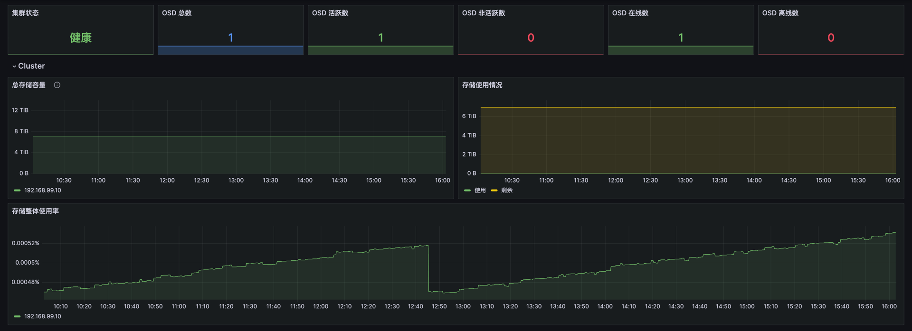
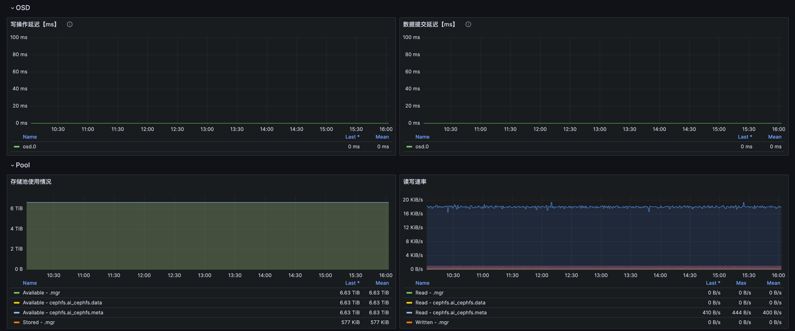
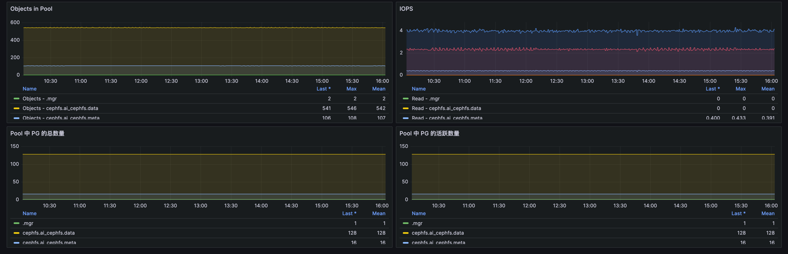

# Ceph 分布式存储监控

## 暴露指标
Cephadm 中MGR守护进程默认有暴露Metric监控指标，直接采集即可端口:9283，Path/metrics。
```
# ceph orch ps | grep mgr
mgr.aitecloud-worker-100-11.dlgfda            aitecloud-worker-100-11  *:9283,8765,8443  running (30h)     4m ago  30h     587M        -  18.2.4   2bc0b0f4375d  c271c3dc59f5  
mgr.aitecloud-worker-100-12.gushne            aitecloud-worker-100-12  *:8443,9283,8765  running (30h)     4m ago  30h     459M        -  18.2.4   2bc0b0f4375d  0f65a6a78db2  

```

## 方便VM收集创建自定义Service
``` 
apiVersion: v1
kind: Endpoints
metadata:
  name: ceph
  namespace: monitoring
subsets:
- addresses:
  - ip: 192.168.100.11
  - ip: 192.168.100.12
  ports:
  - name: http
    port: 9283

---
apiVersion: v1
kind: Service
metadata:
  name: ceph
  namespace: monitoring
spec:
  ports:
  - name: http
    port: 9283
    targetPort: 9283
  type: ClusterIP
```

## 配置指标收集 Job
``` 
  - job_name: 'Baidu-AiteCloud-Ceph'
    kubernetes_sd_configs:
      - role: endpoints
    relabel_configs:
    - source_labels: [__address__]
      regex: '(.*):\d+'
      target_label: instance
      replacement: $1
      action: replace

    - source_labels:
        [
          __meta_kubernetes_namespace,
          __meta_kubernetes_service_name,
        ]
      action: keep
      regex: monitoring;ceph
```

## 监控大盘
[Dashboard JSON](../Dashboard/ceph.json)


