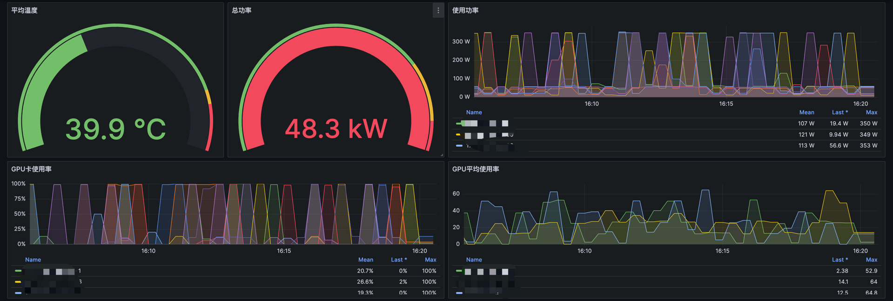
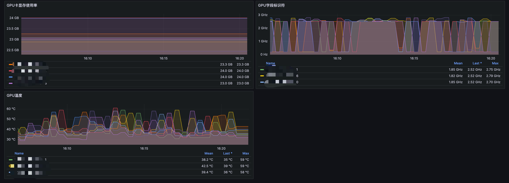

# GPU 资源监控

**前置条件**
- 环境中已安装GPU相关驱动

## 监控范围
- 温度
  - `avg(DCGM_FI_DEV_GPU_TEMP{})`：计算特定实例和 GPU 上的 GPU 温度的平均值。
  - `DCGM_FI_DEV_GPU_TEMP{}`：计算特定实例和 GPU 的当前温度值，而不计算平均值。
- 功率
  - `sum(DCGM_FI_DEV_POWER_USAGE{})`：计算特定实例和 GPU 的总功率使用情况。
  - `DCGM_FI_DEV_POWER_USAGE{}`：计算特定实例和 GPU 的当前功率使用值。
- GPU使用率
  - `DCGM_FI_DEV_GPU_UTIL{}`：计算特定实例和 GPU 的当前 GPU 使用率，以百分比表示。
  - `avg(DCGM_FI_DEV_GPU_UTIL{}) by (instance,Hostname)`：计算节点上的 GPU 使用率的平均值，并按实例和主机名进行分组。
- 显存使用率
  - `DCGM_FI_DEV_FB_USED{}`：计算特定实例和 GPU 的显存使用情况，单位是字节 (Bytes)。
- 字段标识符
  - `DCGM_FI_DEV_SM_CLOCK{} * 1000000`：计算特定实例和 GPU 的 SM (Streaming Multiprocessor) 时钟频率，单位是赫兹 (Hz)，通过乘以 1,000,000 将 MHz 转换为 Hz。


## 安装Exporter
指标配置
``` 
apiVersion: v1
kind: ConfigMap
metadata:
  name: dcgm-metrics
  namespace: monitor
data:
  # 类属性键；每一个键都映射到一个简单的值
  default-counters.csv: |
    # Format,,
    # If line starts with a '#' it is considered a comment,,
    # DCGM FIELD, Prometheus metric type, help message

    # Clocks,,
    DCGM_FI_DEV_SM_CLOCK,  gauge, SM clock frequency (in MHz).
    DCGM_FI_DEV_MEM_CLOCK, gauge, Memory clock frequency (in MHz).

    # Temperature,,
    DCGM_FI_DEV_MEMORY_TEMP, gauge, Memory temperature (in C).
    DCGM_FI_DEV_GPU_TEMP,    gauge, GPU temperature (in C).

    # Power,,
    DCGM_FI_DEV_POWER_USAGE,              gauge, Power draw (in W).
    DCGM_FI_DEV_TOTAL_ENERGY_CONSUMPTION, counter, Total energy consumption since boot (in mJ).

    # PCIE,,
    DCGM_FI_DEV_PCIE_TX_THROUGHPUT,  counter, Total number of bytes transmitted through PCIe TX (in KB) via NVML.
    DCGM_FI_DEV_PCIE_RX_THROUGHPUT,  counter, Total number of bytes received through PCIe RX (in KB) via NVML.
    DCGM_FI_DEV_PCIE_REPLAY_COUNTER, counter, Total number of PCIe retries.

    # Utilization (the sample period varies depending on the product),,
    DCGM_FI_DEV_GPU_UTIL,      gauge, GPU utilization (in %).
    DCGM_FI_DEV_MEM_COPY_UTIL, gauge, Memory utilization (in %).
    DCGM_FI_DEV_ENC_UTIL,      gauge, Encoder utilization (in %).
    DCGM_FI_DEV_DEC_UTIL ,     gauge, Decoder utilization (in %).

    # Errors and violations,,
    DCGM_FI_DEV_XID_ERRORS,            gauge,   Value of the last XID error encountered.
    # DCGM_FI_DEV_POWER_VIOLATION,       counter, Throttling duration due to power constraints (in us).
    # DCGM_FI_DEV_THERMAL_VIOLATION,     counter, Throttling duration due to thermal constraints (in us).
    # DCGM_FI_DEV_SYNC_BOOST_VIOLATION,  counter, Throttling duration due to sync-boost constraints (in us).
    # DCGM_FI_DEV_BOARD_LIMIT_VIOLATION, counter, Throttling duration due to board limit constraints (in us).
    # DCGM_FI_DEV_LOW_UTIL_VIOLATION,    counter, Throttling duration due to low utilization (in us).
    # DCGM_FI_DEV_RELIABILITY_VIOLATION, counter, Throttling duration due to reliability constraints (in us).

    # Memory usage,,
    DCGM_FI_DEV_FB_FREE, gauge, Framebuffer memory free (in MiB).
    DCGM_FI_DEV_FB_USED, gauge, Framebuffer memory used (in MiB).

    # ECC,,
    # DCGM_FI_DEV_ECC_SBE_VOL_TOTAL, counter, Total number of single-bit volatile ECC errors.
    # DCGM_FI_DEV_ECC_DBE_VOL_TOTAL, counter, Total number of double-bit volatile ECC errors.
    # DCGM_FI_DEV_ECC_SBE_AGG_TOTAL, counter, Total number of single-bit persistent ECC errors.
    # DCGM_FI_DEV_ECC_DBE_AGG_TOTAL, counter, Total number of double-bit persistent ECC errors.

    # Retired pages,,
    # DCGM_FI_DEV_RETIRED_SBE,     counter, Total number of retired pages due to single-bit errors.
    # DCGM_FI_DEV_RETIRED_DBE,     counter, Total number of retired pages due to double-bit errors.
    # DCGM_FI_DEV_RETIRED_PENDING, counter, Total number of pages pending retirement.

    # NVLink,,
    # DCGM_FI_DEV_NVLINK_CRC_FLIT_ERROR_COUNT_TOTAL, counter, Total number of NVLink flow-control CRC errors.
    # DCGM_FI_DEV_NVLINK_CRC_DATA_ERROR_COUNT_TOTAL, counter, Total number of NVLink data CRC errors.
    # DCGM_FI_DEV_NVLINK_REPLAY_ERROR_COUNT_TOTAL,   counter, Total number of NVLink retries.
    # DCGM_FI_DEV_NVLINK_RECOVERY_ERROR_COUNT_TOTAL, counter, Total number of NVLink recovery errors.
    DCGM_FI_DEV_NVLINK_BANDWIDTH_TOTAL,            counter, Total number of NVLink bandwidth counters for all lanes

    # VGPU License status,,
    DCGM_FI_DEV_VGPU_LICENSE_STATUS, gauge, vGPU License status

    # Remapped rows,,
    DCGM_FI_DEV_UNCORRECTABLE_REMAPPED_ROWS, counter, Number of remapped rows for uncorrectable errors
    DCGM_FI_DEV_CORRECTABLE_REMAPPED_ROWS,   counter, Number of remapped rows for correctable errors
    DCGM_FI_DEV_ROW_REMAP_FAILURE,           gauge,   Whether remapping of rows has failed
```
DaemonSet
``` 
apiVersion: apps/v1
kind: DaemonSet
metadata:
  name: "dcgm-exporter"
  namespace: monitor
  labels:
    app.kubernetes.io/name: "dcgm-exporter"
    app.kubernetes.io/version: "2.4.0"
  annotations:
    prometheus.io/scrape: "true"
    prometheus.io/port: "9400"
spec:
  updateStrategy:
    type: RollingUpdate
  selector:
    matchLabels:
      app.kubernetes.io/name: "dcgm-exporter"
      app.kubernetes.io/version: "2.4.0"
  template:
    metadata:
      labels:
        app.kubernetes.io/name: "dcgm-exporter"
        app.kubernetes.io/version: "2.4.0"
      name: "dcgm-exporter"
    spec:
      containers:
      - image: "nvcr.io/nvidia/k8s/dcgm-exporter:2.2.9-2.4.0-ubuntu18.04"
        env:
        - name: "DCGM_EXPORTER_LISTEN"
          value: ":9400"
        - name: "DCGM_EXPORTER_KUBERNETES"
          value: "true"
        name: "dcgm-exporter"
        ports:
        - name: "metrics"
          containerPort: 9400
        securityContext:
          runAsNonRoot: false
          runAsUser: 0
        volumeMounts:
        - name: "pod-gpu-resources"
          readOnly: true
          mountPath: "/var/lib/kubelet/pod-resources"
        - name: "gpu-metrics"
          readOnly: true
          mountPath: "/etc/dcgm-exporter"
      volumes:
      - name: "pod-gpu-resources"
        hostPath:
          path: "/var/lib/kubelet/pod-resources"
      - name: "gpu-metrics"
        configMap:
          name: "dcgm-metrics"
      affinity:
        nodeAffinity:
          requiredDuringSchedulingIgnoredDuringExecution:
            nodeSelectorTerms:
            - matchExpressions:
              - key: worknode
                operator: In
                values:
                - gpu

      tolerations:
      - key: "gpu"
        operator: "Equal"
        effect: "NoSchedule"
        value: "yes"
        

---

kind: Service
apiVersion: v1
metadata:
  name: "dcgm-exporter"
  namespace: monitor
  labels:
    app.kubernetes.io/name: "dcgm-exporter"
    app.kubernetes.io/version: "2.4.0"
  annotations:
    prometheus.io/scrape: "true"
    prometheus.io/port: "9400"
spec:
  selector:
    app.kubernetes.io/name: "dcgm-exporter"
    app.kubernetes.io/version: "2.4.0"
  ports:
  - name: "metrics"
    port: 9400
```

## Prometheus 端点配置
``` 
  - job_name: 'kubernetes-gpu-node'
    kubernetes_sd_configs:
    - role: endpoints
    relabel_configs:
    - source_labels:  [__meta_kubernetes_service_label_app_kubernetes_io_name]
      regex: dcgm-exporter
      replacement: $1
      action: keep
```

## 监控大盘

[Dashboard JSON](../Dashboard/gpu.json)



