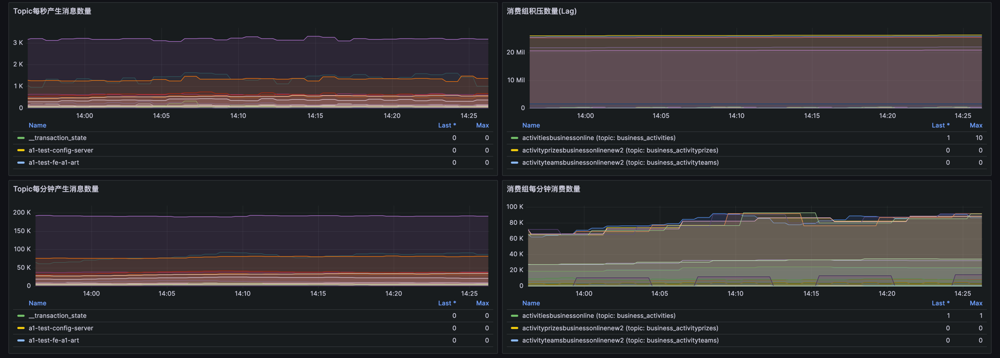
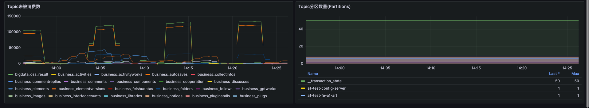

# Kafka 资源监控

**前置条件**
- 环境中存在Kafka服务（新版不需要zk）

## 监控范围

- Broker
    - `kafka_brokers`：broker节点数，指 Kafka 集群中 broker 节点的数量。Brokers 是 Kafka 集群中的服务器，负责存储数据并处理客户端请求。它们的职责是接收、存储和向生产者和消费者提供数据。
- Produce
    - `sum(rate(kafka_topic_partition_current_offset[1m])) by (topic)`：计算每个 Kafka 主题在过去一分钟内 offset 增长的速率。current_offset 是某个主题分区的最新 offset，表示该主题写入了多少数据。用于了解数据被生产到各个主题的速度。
    - `sum(increase(kafka_topic_partition_current_offset[5m])/5) by (topic)`：计算每个主题在 5 分钟间隔内 offset 的平均增长。相较于前一个指标，这个提供了一个更长时间段（5 分钟）的生产速率的平均视图。
    - `sum by(topic) (kafka_topic_partitions)`：计算每个主题的分区总数。知道每个主题的分区数对于理解 Kafka 集群内的数据分布和可扩展性是很重要的。
- Consumer
    - `sum(kafka_consumergroup_lag) by (consumergroup, topic)`：计算每个消费组在每个主题上的滞后量。滞后是指一个主题分区中的最新消息和消费组已经读取的最新消息之间的差距。监控消费者滞后是理解消费者处理消息的进度以及诊断性能瓶颈或识别表现不佳的消费组的关键。
    - `sum(delta(kafka_consumergroup_current_offset[5m])/5) by (consumergroup, topic)`：计算消费者组在 5 分钟间隔内处理 offset 的平均速率。了解消费者组处理消息的速率。
    - `sum(increase(kafka_topic_partition_current_offset[5m])) by(topic) - sum(increase(kafka_consumergroup_current_offset[5m])) by(topic) > 0`：检查每个主题的消息处理是否存在滞后。用于检测消费者组在处理消息时落后的主题，从而可以主动干预以解决潜在的性能问题。

## 安装Exporter
``` 
apiVersion: v1
kind: Secret
type: Opaque
metadata:
  labels:
    app: kafka
  name: kafka-jaas
  namespace: infra

data:
  client-password: ""
  inter-broker-password: ""
  zookeeper-password: ""

---
apiVersion: apps/v1
kind: Deployment
metadata:
  labels:
    app.kubernetes.io/component: metrics
    app.kubernetes.io/instance: kafka
    app.kubernetes.io/name: kafka
  name: kafka-exporter
  namespace: monitor
spec:
  replicas: 1
  selector:
    matchLabels:
      app.kubernetes.io/component: metrics
      app.kubernetes.io/instance: kafka
      app.kubernetes.io/name: kafka
  strategy:
    rollingUpdate:
      maxSurge: 25%
      maxUnavailable: 25%
    type: RollingUpdate
  template:
    metadata:
      creationTimestamp: null
      labels:
        app.kubernetes.io/component: metrics
        app.kubernetes.io/instance: kafka
        app.kubernetes.io/name: kafka
    spec:
      containers:
      - command:
        - /bin/bash
        - -ec
        - |
          kafka_exporter \
          --kafka.server=kafka-0.kafka-headless.infra.svc.cluster.local:9092 \
          --kafka.server=kafka-1.kafka-headless.infra.svc.cluster.local:9092 \
          --kafka.server=kafka-2.kafka-headless.infra.svc.cluster.local:9092 \
          --web.listen-address=:9308
        env:
        - name: SASL_USER_PASSWORD
          valueFrom:
            secretKeyRef:
              key: client-password
              name: kafka-jaas
        image: docker.io/bitnami/kafka-exporter:1.2.0-debian-10-r131
        imagePullPolicy: IfNotPresent
        name: kafka-exporter
        ports:
        - containerPort: 9308
          name: metrics
          protocol: TCP
      dnsPolicy: ClusterFirst
      restartPolicy: Always

---
apiVersion: v1
kind: Service
metadata:
  labels:
    app.kubernetes.io/component: metrics
    app.kubernetes.io/instance: kafka
    app.kubernetes.io/name: kafka
  name: kafka-metrics
  namespace: monitor
spec:
  internalTrafficPolicy: Cluster
  ipFamilies:
  - IPv4
  ipFamilyPolicy: SingleStack
  ports:
  - name: http-metrics
    port: 9308
    protocol: TCP
    targetPort: metrics
  selector:
    app.kubernetes.io/component: metrics
    app.kubernetes.io/instance: kafka
    app.kubernetes.io/name: kafka
```

## Prometheus 端点配置
``` 
    - job_name: 'Kafka'
      scrape_interval: 1m
      static_configs:
        - targets: 
          - kafka-exporter.monitor:5557
```

## 监控大盘

[Dashboard JSON](../Dashboard/kafka.json)

