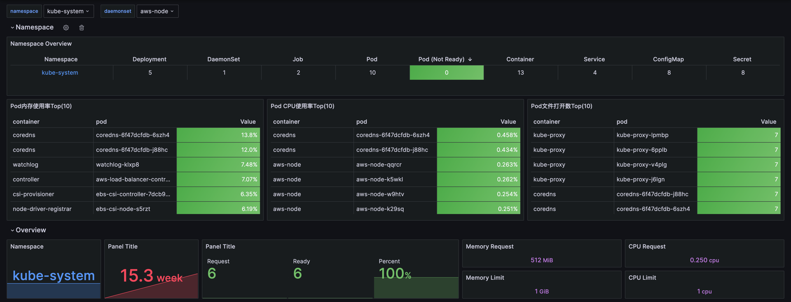
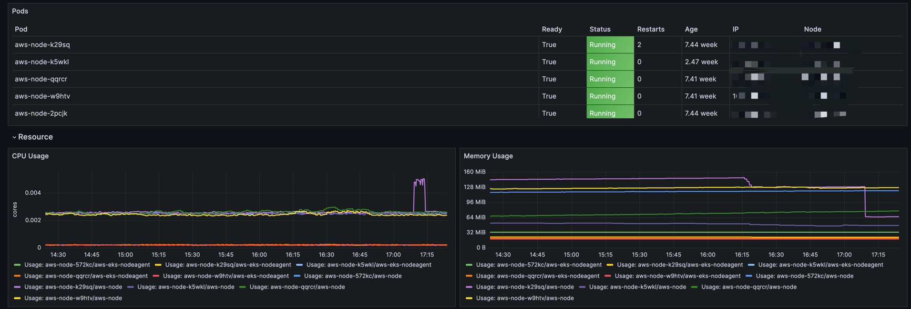
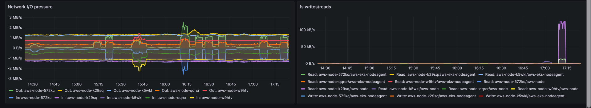
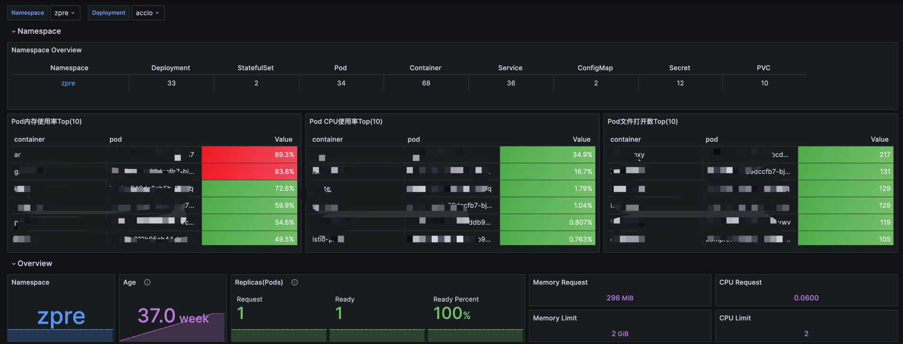
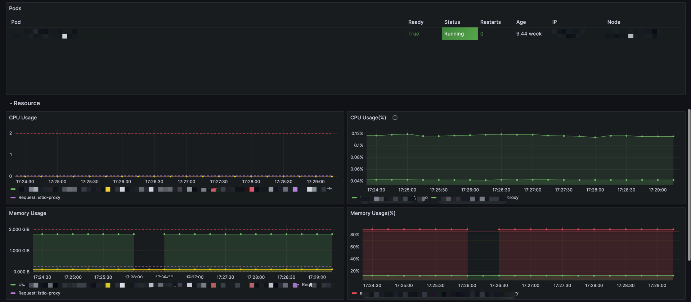
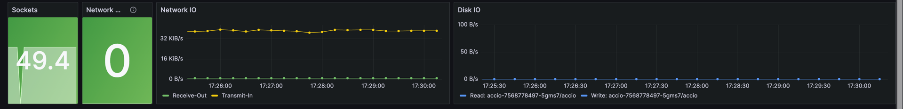
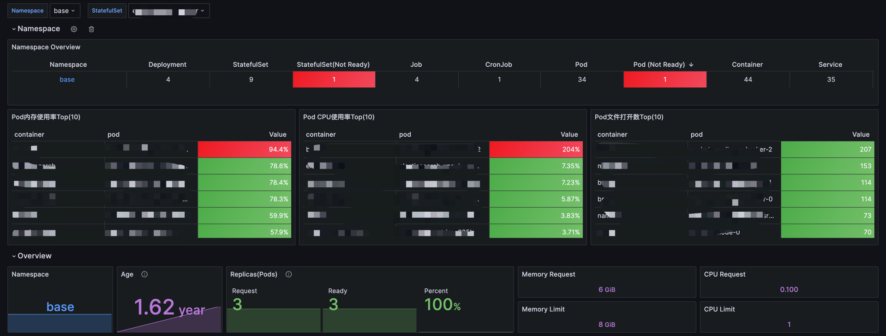
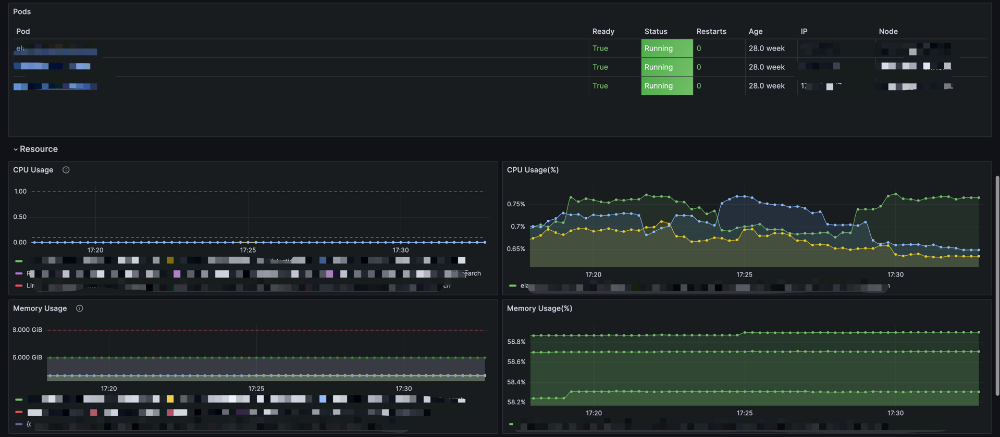
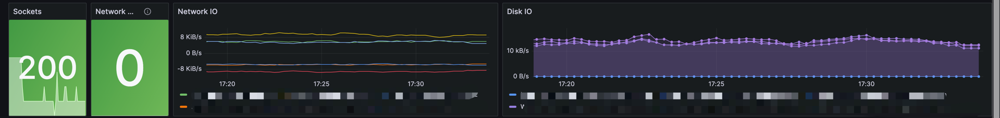

# Kubernetes 控制器资源监控
本章针对Kubernetes的控制器来展开三个监控的方向

- Deployment
- StatefulSet
- DaemonSet

所需Exporter

- kube-state-metrics：主要收集k8s集群内部的资源数据；
- cadvisor(kubelet 内置)：主要收集容器运行时的指标数据；

## 监控范围

- Namespace级别的Top资源统计；
  - `topk(10, sum(irate(container_cpu_usage_seconds_total{container!="",container!="POD",pod!=""}[1m]) * 100) by (container,pod,namespace)or on() vector(0))`：计算在过去 1 分钟内，CPU 使用率最高的前 10 个容器。帮助识别 CPU 消耗最高的工作负载，以便优化资源分配和性能调优。
  - `topk(10, avg(container_memory_working_set_bytes{pod!="",container!=""}/(container_spec_memory_limit_bytes!=0) * 100) by (container, pod, namespace))`：计算在指定时间段内，内存使用率最高的前 10 个容器。帮助识别内存消耗最高的工作负载，以便进行资源优化。
  - `topk(10, sum(container_sockets{container!="",pod!=""}) by (container,pod,namespace)or on() vector(0))`：计算每个容器的 Socket 使用情况，并找出使用 Socket 最多的前 10 个容器。识别可能导致网络瓶颈的容器，以便进行网络优化。
- Pod状态、基础资源(使用daemonset举例)；
  - `kube_daemonset_status_number_ready{daemonset="$daemonset",namespace="$namespace"}`：获取指定 DaemonSet 中已就绪的 Pod 数量。监控 DaemonSet 的健康状态，确保所需的 Pod 数量正常运行。
  - `group(kube_pod_info{created_by_kind="DaemonSet",pod_ip!=""}) by (pod)* on(pod) group_right() max(rate(container_cpu_usage_seconds_total{container!="",container!="POD"}[5m])) by (pod, container)`：获取 DaemonSet 中每个 Pod 的 CPU 使用情况。帮助识别 DaemonSet 中的 Pod 的 CPU 使用情况，进行性能监控和优化。
  - `group(kube_pod_info{created_by_kind="DaemonSet"}) by (pod)* on(pod) group_right() max(container_memory_usage_bytes{container!="POD",container!=""}) by(container, pod)`：获取 DaemonSet 中每个 Pod 的内存使用情况。监控 DaemonSet 中的内存使用情况，以便进行资源管理和优化。
  - `sum(kube_pod_info{created_by_kind="DaemonSet",pod_ip!=""}) by (pod)* on(pod) group_right() max(rate(container_network_receive_bytes_total{}[5m])) by (pod)`：获取 DaemonSet 中每个 Pod 的网络接收流量。监控 DaemonSet 中的网络使用情况，识别潜在的网络瓶颈。
  - `group(kube_pod_info{created_by_kind="DaemonSet",pod_ip!=""}) by (pod)* on(pod) group_right() max(rate(container_fs_reads_bytes_total{container!="POD", container!=""}[5m])) by (pod,container)`：获取 DaemonSet 中每个 Pod 的文件系统读取情况。监控 DaemonSet 中的磁盘使用情况，以便进行性能优化和容量规划。

## 安装kube-state-metrics
``` 
---
apiVersion: v1
kind: ServiceAccount
metadata:
  name: kube-state-metrics
  namespace: kube-system
---
apiVersion: rbac.authorization.k8s.io/v1
kind: ClusterRole
metadata:
  name: kube-state-metrics
rules:
- apiGroups: [""]
  resources: ["nodes", "pods", "services", "resourcequotas", "replicationcontrollers", "limitranges", "persistentvolumeclaims", "persistentvolumes", "namespaces", "endpoints"]
  verbs: ["list", "watch"]
- apiGroups: ["extensions"]
  resources: ["daemonsets", "deployments", "replicasets"]
  verbs: ["list", "watch"]
- apiGroups: ["apps"]
  resources: ["statefulsets"]
  verbs: ["list", "watch"]
- apiGroups: ["batch"]
  resources: ["cronjobs", "jobs"]
  verbs: ["list", "watch"]
- apiGroups: ["autoscaling"]
  resources: ["horizontalpodautoscalers"]
  verbs: ["list", "watch"]
---
apiVersion: rbac.authorization.k8s.io/v1
kind: ClusterRoleBinding
metadata:
  name: kube-state-metrics
roleRef:
  apiGroup: rbac.authorization.k8s.io
  kind: ClusterRole
  name: kube-state-metrics
subjects:
- kind: ServiceAccount
  name: kube-state-metrics
  namespace: kube-system

---
apiVersion: v1
kind: Service
metadata:
  annotations:
    prometheus.io/scrape: 'true'
  labels:
    app.kubernetes.io/name: kube-state-metrics
    app.kubernetes.io/version: v2.2.1
  name: kube-state-metrics
  namespace: kube-system
spec:
  clusterIP: None
  ports:
  - name: http-metrics
    port: 8080
    targetPort: http-metrics
  - name: telemetry
    port: 8081
    targetPort: telemetry
  selector:
    app.kubernetes.io/name: kube-state-metrics

---
apiVersion: apps/v1
kind: Deployment
metadata:
  labels:
    app.kubernetes.io/name: kube-state-metrics
    app.kubernetes.io/version: v2.2.1
  name: kube-state-metrics
  namespace: kube-system
  
spec:
  replicas: 1
  selector:
    matchLabels:
      app.kubernetes.io/name: kube-state-metrics
      
  template:
    metadata:
      labels:
        app.kubernetes.io/name: kube-state-metrics
        app.kubernetes.io/version: v2.2.1
        
    spec:
      containers:
      - image: registry.cn-shenzhen.aliyuncs.com/starsl/kube-state-metrics:v2.2.1
        livenessProbe:
          httpGet:
            path: /healthz
            port: 8080
          initialDelaySeconds: 5
          timeoutSeconds: 5
        name: kube-state-metrics
        ports:
        - containerPort: 8080
          name: http-metrics
        - containerPort: 8081
          name: telemetry
        readinessProbe:
          httpGet:
            path: /
            port: 8081
          initialDelaySeconds: 5
          timeoutSeconds: 5
      nodeSelector:
        beta.kubernetes.io/os: linux
      serviceAccountName: kube-state-metrics
```
## Prometheus 端点配置
``` 
- job_name: kubernetes-cadvisor
  honor_timestamps: true
  scrape_interval: 15s
  scrape_timeout: 10s
  metrics_path: /metrics
  scheme: https
  authorization:
    type: Bearer
    credentials_file: /var/run/secrets/kubernetes.io/serviceaccount/token
  tls_config:
    insecure_skip_verify: true
  follow_redirects: true
  enable_http2: true
  relabel_configs:
  - separator: ;
    regex: (.*)
    target_label: __address__
    replacement: kubernetes.default.svc:443
    action: replace
  - source_labels: [__meta_kubernetes_node_name]
    separator: ;
    regex: (.+)
    target_label: __metrics_path__
    replacement: /api/v1/nodes/${1}/proxy/metrics/cadvisor
    action: replace
  - separator: ;
    regex: __meta_kubernetes_node_label_(.+)
    replacement: $1
    action: labelmap
  kubernetes_sd_configs:
  - role: node
    kubeconfig_file: ""
    follow_redirects: true
    enable_http2: true
    
- job_name: kubernetes-kube-state-metrics
  honor_timestamps: true
  scrape_interval: 15s
  scrape_timeout: 10s
  metrics_path: /metrics
  scheme: http
  follow_redirects: true
  enable_http2: true
  relabel_configs:
  - source_labels: [__meta_kubernetes_service_label_app_kubernetes_io_name]
    separator: ;
    regex: kube-state-metrics
    replacement: $1
    action: keep
  - source_labels: [__address__]
    separator: ;
    regex: (.*):8080
    replacement: $1
    action: keep
  kubernetes_sd_configs:
  - role: endpoints
    kubeconfig_file: ""
    follow_redirects: true
    enable_http2: true
```

## 监控大盘

### DaemonSet
[DaemonSet Dashboard JSON](../Dashboard/daemonset.json)





### Deployment
[Deployment Dashboard JSON](../Dashboard/deployment.json)





### StatefulSet
[StatefulSet Dashboard JSON](../Dashboard/statefulset.json)



