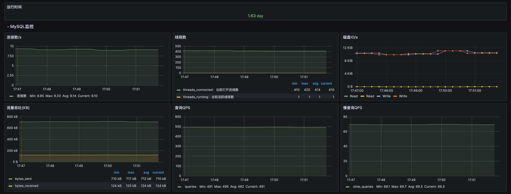
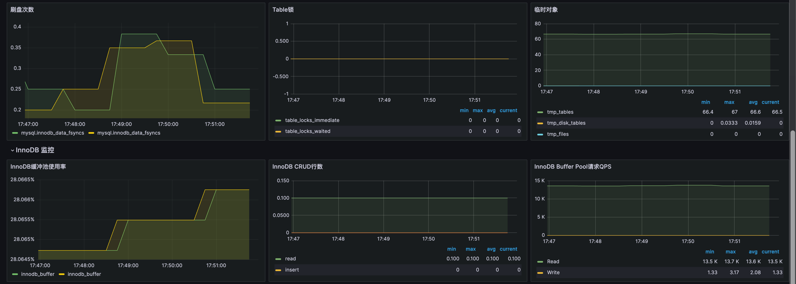
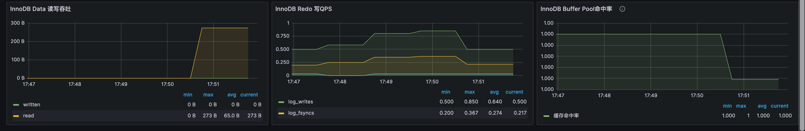

# MySQL 资源监控

**前置条件**
- 环境中已部署MySQL；
- 授权监控账号
``` 
CREATE USER 'exporter'@'%' IDENTIFIED BY 'exporter_2024';
GRANT PROCESS, REPLICATION CLIENT, SELECT ON *.* TO 'exporter'@'%';
FLUSH PRIVILEGES;
```
## 监控范围
- 连接数/线程数
  - `max(irate(mysql_global_status_connections[1m]))`：过去一分钟内每秒新增连接数的最大值。用于监控连接频率，帮助识别潜在的连接峰值和负载问题。
  - `avg(mysql_global_status_threads_connected)`：当前连接到 MySQL 的客户端线程的平均数量。用于监控 MySQL 的活跃连接数，帮助检测潜在的连接泄漏问题。
  - `avg(mysql_global_status_threads_running)`：当前正在运行的线程的平均数量。用于监控服务器的活动负载，帮助识别高负载期间的瓶颈。
- 磁盘IO/吞吐量
  - `rate(mysql_global_status_innodb_data_reads[5m]) * 16384`：计算 InnoDB 数据读取操作的速率并乘以 InnoDB 页大小（通常为 16KB）得到每秒读取的字节数。用于监控磁盘读取操作，帮助识别潜在的磁盘瓶颈。
  - `rate(mysql_global_status_innodb_data_writes[5m]) * 16384`：计算 InnoDB 数据写入操作的速率并乘以 InnoDB 页大小得到每秒写入的字节数。用于监控磁盘写入操作，帮助识别磁盘写入性能问题。
  - `avg(irate(mysql_global_status_bytes_sent[1m]))`：计算 MySQL 发送的字节速率的平均值。用于监控网络带宽的发送量，识别潜在的网络带宽瓶颈。
  - `avg(irate(mysql_global_status_bytes_received[1m]))`：计算 MySQL 接收的字节速率的平均值。用于监控网络带宽的接收量，帮助识别网络流量高峰。
- 查询/慢查询QPS
  - `avg(irate(mysql_global_status_queries[1m]))`：计算每分钟内 MySQL 查询的平均速率。用于监控查询负载，帮助识别查询瓶颈。
  - `avg(irate(mysql_global_status_slow_queries[1m]))`：计算每分钟内 MySQL 慢查询的平均速率。用于监控慢查询的出现频率，帮助优化查询性能。
- 刷盘次数
  - `irate(mysql_global_status_innodb_data_fsyncs[5m])`：计算每 5 分钟内 InnoDB 执行 fsync 操作的速率。用于监控磁盘同步操作的频率，帮助识别 I/O 瓶颈。
- 表锁
  - `avg(irate(mysql_global_status_table_locks_immediate[1m]))`：计算每分钟内成功获取表锁的平均速率。用于监控表锁获取频率，帮助识别潜在的锁争用问题。
  - `avg(irate(mysql_global_status_table_locks_waited[1m]))`：计算每分钟内表锁等待的平均速率。用于监控表锁等待时间，帮助识别锁等待瓶颈。
- 临时对象
  - `avg(irate(mysql_global_status_created_tmp_tables[1m]))`：计算每分钟内创建的临时表的平均速率。用于监控临时表的创建，帮助优化查询效率。
  - `avg(irate(mysql_global_status_created_tmp_disk_tables[1m]))`：计算每分钟内创建的磁盘临时表的平均速率。用于监控磁盘临时表的使用，帮助识别磁盘 I/O 问题。
  - `avg(irate(mysql_global_status_created_tmp_files[1m]))`：计算每分钟内创建的临时文件的平均速率。用于监控临时文件的创建，帮助识别文件系统瓶颈。
- InnoDB
  - `(mysql_global_status_innodb_buffer_pool_bytes_data / mysql_global_variables_innodb_buffer_pool_size) * 100`：计算 InnoDB 缓冲池已用数据字节数与缓冲池总大小的百分比。用于监控缓冲池的利用率，帮助优化内存使用。
  - `avg(irate(mysql_global_status_innodb_system_rows_read[1m]))`：计算每分钟内 InnoDB 系统读取的行数。用于监控 InnoDB 系统的读取负载。
  - `avg(irate(mysql_global_status_innodb_system_rows_inserted[1m]))`：计算每分钟内 InnoDB 系统插入的行数。用于监控 InnoDB 系统的写入负载。
  - `avg(irate(mysql_global_status_innodb_system_rows_updated[1m]))`：计算每分钟内 InnoDB 系统更新的行数。用于监控 InnoDB 系统的更新操作。
  - `avg(irate(mysql_global_status_innodb_system_rows_deleted[1m]))`：计算每分钟内 InnoDB 系统删除的行数。用于监控 InnoDB 系统的删除操作。
  - `avg(irate(mysql_global_status_innodb_buffer_pool_read_requests[1m]))`：计算每分钟内 InnoDB 缓冲池读取请求的平均速率。用于监控缓冲池的读取请求，帮助优化内存使用。
  - `avg(irate(mysql_global_status_innodb_buffer_pool_write_requests[1m]))`：计算每分钟内 InnoDB 缓冲池写入请求的平均速率。用于监控缓冲池的写入请求，帮助优化磁盘 I/O。
  - `avg(irate(mysql_global_status_innodb_data_written[1m]))`：计算每分钟内 InnoDB 数据写入的字节数。用于监控数据写入的速率，帮助识别潜在的磁盘瓶颈。
  - `avg(irate(mysql_global_status_innodb_data_read[1m]))`：计算每分钟内 InnoDB 数据读取的字节数。用于监控数据读取的速率，帮助识别潜在的磁盘瓶颈。
  - `avg(irate(mysql_global_status_innodb_log_writes[1m]))`：计算每分钟内 InnoDB 日志写入的次数。用于监控日志写入的频率，帮助识别潜在的 I/O 瓶颈。
  - `avg(irate(mysql_global_status_innodb_os_log_fsyncs[1m]))`：计算每分钟内 InnoDB 操作系统日志同步的次数。用于监控日志同步操作的频率，帮助识别潜在的 I/O 瓶颈。
  - `avg(irate(mysql_global_status_innodb_log_write_requests[1m]))`：计算每分钟内 InnoDB 日志写入请求的次数。用于监控日志写入请求的频率，帮助识别潜在的 I/O 瓶颈。
  - `(rate(mysql_global_status_innodb_buffer_pool_read_requests[3m]) rate(mysql_global_status_innodb_buffer_pool_reads[3m]))
  /
  rate(mysql_global_status_innodb_buffer_pool_read_requests[3m])
  `：计算 MySQL InnoDB 缓冲池的缓存命中率。用于评估内存缓存的效果，以及系统从缓冲池读取数据的效率。


## 安装Exporter
``` 
apiVersion: v1
kind: ConfigMap
metadata:
  name: mysql-exporter
  namespace: kube-monitoring
data:
  my.cnf: |-
    [client]
    host=mariadb-test-mariadb-galera.infra
    port=3306
    user=exporter
    password=exporter_2024

---
apiVersion: apps/v1
kind: Deployment
metadata:
  name: mysql-exporter
  namespace: kube-monitoring
spec:
  replicas: 1
  selector:
    matchLabels:
      app: mysql-exporter
  template:
    metadata:
      labels:
        app: mysql-exporter
    spec:
      containers:
        - name: mysql-exporter
          image: registry.js.design/prometheus/mysqld-exporter:latest
          ports:
            - name: metrics
              containerPort: 9104
          command:
            - mysqld_exporter
            - --config.my-cnf=/cfg/my.cnf
          volumeMounts:
            - mountPath: /cfg/my.cnf
              name: mysql-exporter
              subPath: my.cnf
      volumes:
        - configMap:
            defaultMode: 420
            name: mysql-exporter
          name: mysql-exporter

---
apiVersion: v1
kind: Service
metadata:
  name: mysql-exporter
  namespace: kube-monitoring
spec:
  ports:
    - port: 9104
      targetPort: 9104
      protocol: TCP
      name: metrics
  selector:
    app: mysql-exporter
```

## 查看指标数据
``` 
[root@iZ2zeh5cd0wu2m4o1m5xjaZ ~]# curl 192.168.44.53:9104/metrics -s | grep mysql_up
# HELP mysql_up Whether the MySQL server is up.
# TYPE mysql_up gauge
mysql_up 1
```
- mysql_up 1：：代表成功连接MySQL并采集到指标数据

## Prometheus 端点配置
``` 
    - job_name: 'MySQL'
      scrape_interval: 1m
      static_configs:
        - targets: ['mysql-exporter.monitor:9104']
```

## 监控大盘

[Dashboard JSON](../Dashboard/mysql.json)



