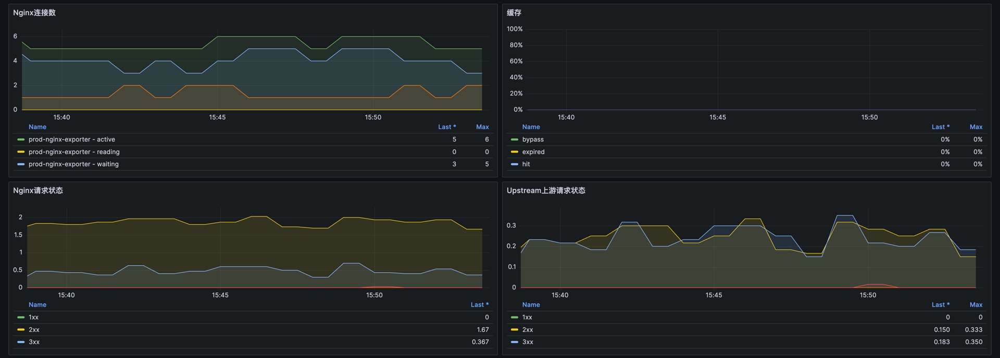
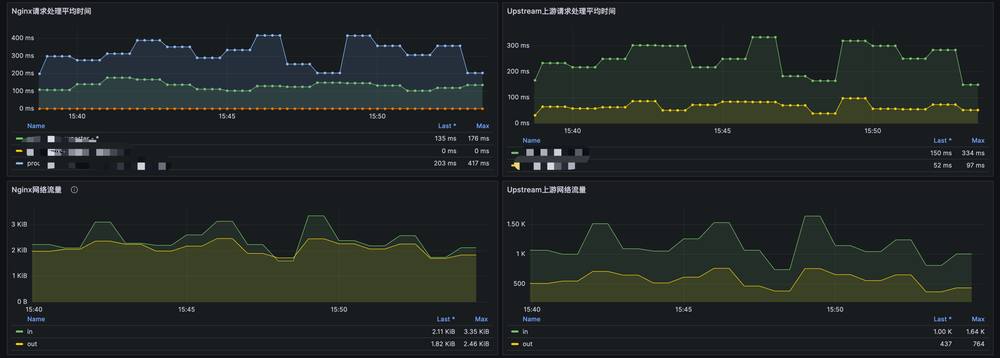
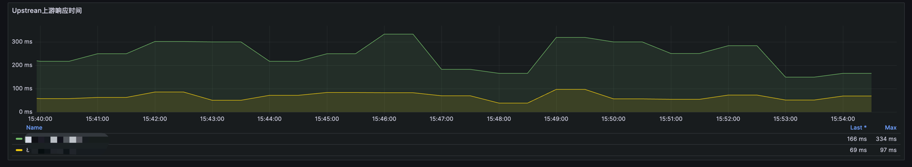

# Nginx 资源监控

**前置条件**
- 环境中存在Nginx服务
- nginx中存在`ngx_http_vhost_traffic_status_module`模块, (`docker.io/cairry/nginx:1.18.0-amd64-2024.5.17_17.11.15`此镜像已安装相关模块，使用下方配置即可)
- 开启nginx status模块
- 示例配置
``` 
  nginx.conf: |
    load_module "/etc/nginx/modules/ngx_http_vhost_traffic_status_module.so";

    user  root;
    worker_processes  auto;

    error_log  /var/log/nginx/nginx-error.log notice;
    pid        /var/run/nginx.pid;

    events {
        worker_connections  65535;
        use epoll;
    }

    http {
      vhost_traffic_status_zone;  
      vhost_traffic_status_filter_by_host on;

      include       /etc/nginx/mime.types;
      default_type  application/octet-stream;
      # limit_req_zone $uri zone=api_read:20m rate=200r/s;
      # limit_req_zone $uri zone=api_write:20m rate=50r/s;

      log_format json escape=json 
        '{"timestamp": "$time_local",'
        '"remote_addr": "$remote_addr",'
        '"referer": "$http_referer",'
        '"request": "$request",'
        '"status": "$status",'
        '"bytes": "$body_bytes_sent",'
        '"agent": "$http_user_agent",'
        '"x_forwarded": "$http_x_forwarded_for",'
        '"request_body": "$request_body",'
        '"up_addr": "$upstream_addr",'
        '"up_host": "$upstream_http_host",'
        '"upstream_time": "$upstream_response_time",'
        '"request_time": "$request_time",'
        '"unionid": "$unionid"}';

      sendfile        on;
      tcp_nopush     on;
      proxy_buffering off;
      keepalive_timeout  75;
      gzip  on;
      include /etc/nginx/conf.d/*.conf;
      
      server {
        listen 81;
        location /status {
            vhost_traffic_status_display;
            vhost_traffic_status_display_format html;
        }
      }
    }
```

## 监控范围
- 连接数
  - `nginx_server_connections{status=~"active|writing|reading|waiting"}`：用于监控 Nginx 服务器当前处理的连接数。
    - active: 表示 Nginx 当前正在处理的总连接数，包括正在读取、写入和等待的连接数。这是当前 Nginx 处理负载的一个整体快照。 
    - writing: 表示 Nginx 正在向客户端发送数据的连接数。较高的数值可能表示 Nginx 正在处理大量的响应发送。 
    - reading: 表示 Nginx 正在从客户端读取数据的连接数，包括读取请求头和请求体的数据。 
    - waiting: 表示处于空闲状态的连接数（即保持活动的连接，通常用于 keep-alive 连接）。这些连接当前未被使用进行读取或写入。
- 缓存
  - `sum(irate(nginx_server_cache{}[5m])) by (status,host)`：用于监控 Nginx 服务器上的缓存活动，并根据状态和主机进行聚合分析。
    - hit: 请求从缓存中直接返回，减少了对后端服务器的负载并提高了响应速度。
    - miss: 请求未命中缓存，需要从后端服务器获取数据。
    - bypass: 请求绕过缓存，通常是由于特定的配置条件（例如，某些 cookie 或 header）导致的。
    - expired: 缓存中的条目已过期，需要从后端服务器刷新。
- 请求状态
  - `sum(irate(nginx_server_requests{code!="total"}[5m])) by (code)`：此指标用于监控 Nginx 服务器收到的 HTTP 请求服务器返回的 HTTP 状态码。
  - `sum(irate(nginx_upstream_requests{code!="total"}[5m])) by (code)`：此指标用于监控 Nginx **上游**服务器收到的 HTTP 请求服务器返回的 HTTP 状态码。
- 请求处理时间
  - `sum(nginx_server_requestMsec{}) by (service_name,host)`：测量 Nginx 处理请求所花费的总时间（以毫秒为单位）。
  - `sum(nginx_upstream_requestMsec{}) by (instance,backend)`：测量上游服务器处理请求所花费的时间。
- 网络流量
  - `sum(irate(nginx_server_bytes{}[5m])) by (direction)`：测量 Nginx 服务器传输的字节数。分析网络流量有助于评估服务器的带宽使用情况、识别潜在的网络问题，并优化数据传输性能。
  - `sum(irate(nginx_upstream_bytes{}[5m])) by (direction)`：测量上游服务器的字节传输。
- 响应时间
  - `sum(nginx_upstream_responseMsec{}) by (backend)`：测量上游服务器响应请求所花费的总时间。

## 安装Exporter
``` 
apiVersion: apps/v1
kind: Deployment
metadata:
  labels:
    app: prod-nginx-exporter
  name: prod-nginx-exporter
  namespace: monitor
spec:
  replicas: 1
  selector:
    matchLabels:
      app: prod-nginx-exporter
  template:
    metadata:
      labels:
        app: prod-nginx-exporter
    spec:
      containers:
      - image: docker.io/cairry/nginx-vts-exporter:latest
        imagePullPolicy: IfNotPresent
        name: prod-nginx-exporter
        env:
        - name: NGINX_STATUS
          value: "http://proxy.proxy-prod:81/status/format/json"
        ports:
        - containerPort: 9913
          protocol: TCP
        resources:
          limits:
            cpu: "1"
            memory: 1024Mi
          requests:
            cpu: 100m
            memory: 100Mi
--- 
apiVersion: v1
kind: Service
metadata:
  name: prod-nginx-exporter
  namespace: monitor
spec:
  ports:
  - name: http
    port: 9913
    protocol: TCP
    targetPort: 9913
  selector:
    app: prod-nginx-exporter
  sessionAffinity: None
  type: ClusterIP
```
## Prometheus 端点配置
``` 
    - job_name: 'nginx-vts-exporter'
      kubernetes_sd_configs:
        - role: endpoints
          namespaces:
            names:
            - monitor
      relabel_configs:
        - source_labels: [__meta_kubernetes_service_name]
          target_label: service_name
          action: replace
        - source_labels: [__address__]
          regex: '(.*):9913'
          target_label: __address__
          action: keep
```

## 监控大盘

[Dashboard JSON](../Dashboard/nginx.json)


