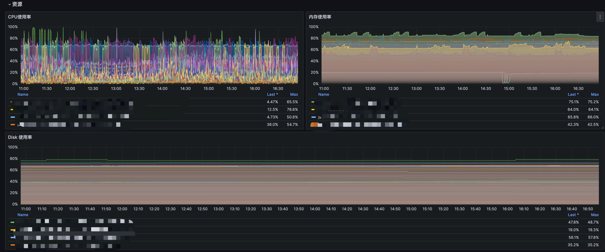
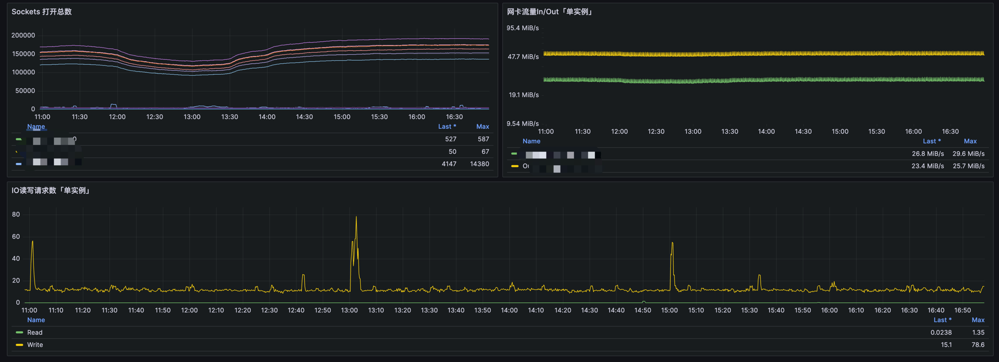
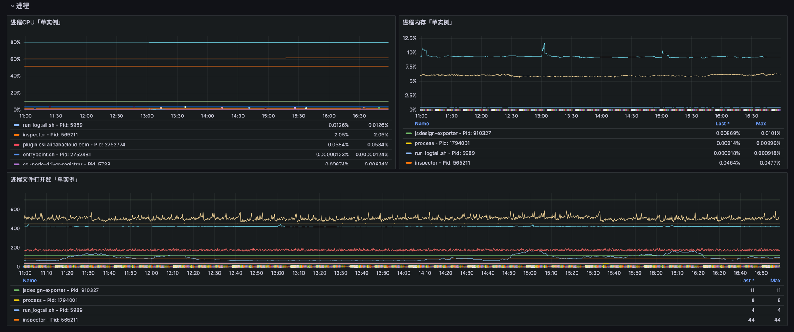

# 服务器资源监控
本章针对服务器资源展开两部分的监控方向，以Kubernetes方式部署；

- 服务器基础资源（node-exporter），包含服务器的CPU、Memory、Disk、Socket、Network以及Disk IO等；

- 进程资源（[node-process-exporter](https://github.com/Cairry/node-process-exporter)），包含进程的CPU、Memory、Open files；

## 监控范围
- 服务器资源使用率
  - `100 - (avg(irate(node_cpu_seconds_total{mode="idle",}[5m])) by (instance,service_id,ecs_cname) * 100) `：计算 CPU 使用率，表示在过去 5 分钟内，CPU 非空闲时间占总时间的百分比。监控 CPU 使用情况，识别高负载情况，帮助进行容量规划和性能调优。
  - `100 - (node_memory_MemAvailable_bytes{} / node_memory_MemTotal_bytes{} * 100)`：计算内存使用率，表示可用内存占总内存的百分比。监控系统内存使用，帮助识别内存不足问题和优化内存配置。
  - `max((node_filesystem_size_bytes{fstype=~"ext.?|xfs",}-node_filesystem_free_bytes{fstype=~"ext.?|xfs",}) *100/(node_filesystem_avail_bytes {fstype=~"ext.?|xfs",}+(node_filesystem_size_bytes{fstype=~"ext.?|xfs",}-node_filesystem_free_bytes{fstype=~"ext.?|xfs",})))by(ecs_cname,instance,service_id)`：计算文件系统的使用率，支持 ext 文件系统和 xfs 文件系统，表示已用空间占总空间的百分比。监控磁盘使用情况，帮助避免磁盘满的问题，确保文件系统正常运行。
  - `sum(label_replace(max(node_sockstat_TCP_alloc{}) by (instance),"host_ip","$1","instance","(.*):.*"))by(instance)`：计算分配的 TCP 连接数。监控系统的 TCP 连接使用情况，识别是否有过多的连接导致性能问题。
  - `sum(label_replace(max(irate(node_network_receive_bytes_total{}[1m])) by (instance),"host_ip","$1","instance","(.*):.*"))by(instance)`：计算每秒接收的网络字节数。监控网络流量输入，帮助识别网络瓶颈和流量高峰。
  - `sum(label_replace(max(irate(node_network_transmit_bytes_total{}[1m])) by (instance),"host_ip","$1","instance","(.*):.*"))by(instance)`：计算每秒发送的网络字节数。监控网络流量输出，帮助识别网络性能问题。
  - `avg(rate(node_disk_reads_completed_total{}[1m]))`：每秒完成的磁盘读取次数。监控磁盘读取活动，帮助识别磁盘 I/O 性能问题。
  - `avg(rate(node_disk_writes_completed_total{}[1m]))`：每秒完成的磁盘写入次数。监控磁盘写入活动，帮助识别磁盘性能瓶颈。
- 进程资源使用率
  - `describe_node_process_cpu_info{name!="containerd-shim", name!="containerd-shim-runc-v2"}`：进程级别的 CPU 使用情况。识别消耗 CPU 资源的进程，帮助进行进程性能优化。
  - `describe_node_process_memory_info{instance="${instance}", name!="containerd-shim", name!="containerd-shim-runc-v2"}`：进程级别的内存使用情况。识别高内存消耗的进程，帮助进行内存优化。
  - `describe_node_process_openfiles_info{name!="containerd-shim", name!="containerd-shim-runc-v2"}`：进程级别的打开文件数。监控进程打开的文件数，防止超过系统限制导致的问题。

## 部署Node-exporter
**部署配置**
``` 
apiVersion: apps/v1
kind: DaemonSet
metadata:
  labels:
    name: prom-node-exporter
  name: prom-node-exporter
  namespace: monitor
spec:
  revisionHistoryLimit: 10
  selector:
    matchLabels:
      name: prom-node-exporter
  template:
    metadata:
      labels:
        name: prom-node-exporter
    spec:
      containers:
      - args:
        - --path.procfs
        - /host/proc
        - --path.sysfs
        - /host/sys
        command:
        - node_exporter
        - --web.listen-address=:9100
        image: registry.js.design/prometheus/node-exporter:v1.0.1
        imagePullPolicy: IfNotPresent
        name: node-exporter
        ports:
        - containerPort: 9100
          hostPort: 9100
          protocol: TCP
        resources: {}
        securityContext:
          privileged: true
        terminationMessagePath: /dev/termination-log
        terminationMessagePolicy: File
        volumeMounts:
        - mountPath: /host/dev
          name: dev
        - mountPath: /host/proc
          name: proc
        - mountPath: /host/sys
          name: sys
        - mountPath: /rootfs
          name: rootfs
        - mountPath: /data
          name: rootfs-data
      dnsPolicy: ClusterFirst
      hostIPC: true
      hostNetwork: true
      hostPID: true
      restartPolicy: Always
      tolerations:
      - operator: Exists
      - effect: NoSchedule
        key: mongodb
        operator: Equal
        value: "yes"
      - effect: NoSchedule
        key: gpu
        operator: Equal
        value: "yes"
      - effect: NoSchedule
        key: middleware
        operator: Equal
        value: "true"
      volumes:
      - hostPath:
          path: /dev
          type: ""
        name: dev
      - hostPath:
          path: /proc
          type: ""
        name: proc
      - hostPath:
          path: /sys
          type: ""
        name: sys
      - hostPath:
          path: /
          type: ""
        name: rootfs
      - hostPath:
          path: /data
          type: ""
        name: rootfs-data

---
apiVersion: v1
kind: Service
metadata:
  labels:
    name: prom-node-exporter
  name: prom-node-exporter
  namespace: monitor
spec:
  ports:
  - port: 9100
    protocol: TCP
    targetPort: 9100
  selector:
    name: prom-node-exporter
  sessionAffinity: None
  type: ClusterIP
```

## 部署Node-process-exporter
**部署配置**
``` 
apiVersion: apps/v1
kind: DaemonSet
metadata:
  labels:
    app: node-process-exporter
  name: node-process-exporter
  namespace: monitor
spec:
  selector:
    matchLabels:
      app: node-process-exporter
  template:
    metadata:
      labels:
        app: node-process-exporter
    spec:
      containers:
      - image: cairry/node-process-exporter:latest
        imagePullPolicy: IfNotPresent
        name: node-process-exporter
        ports:
        - containerPort: 9002
          hostPort: 9002
          protocol: TCP
        resources:
          limits:
            cpu: "1"
            memory: 1Gi
          requests:
            cpu: 250m
            memory: 512Mi
        securityContext:
          privileged: true

      hostIPC: true
      hostNetwork: true
      hostPID: true
      restartPolicy: Always
      tolerations:
      - effect: NoSchedule
        operator: Exists

---
apiVersion: v1
kind: Service
metadata:
  name: node-process-exporter
  namespace: monitor
spec:
  ports:
  - port: 9002
    protocol: TCP
    targetPort: 9002
  selector:
    app: node-process-exporter
  sessionAffinity: None
  type: ClusterIP
```

## Prometheus 端点配置
``` 
    - job_name: 'kubernetes-kubelets'
      kubernetes_sd_configs:
        - role: node
      relabel_configs:
        - source_labels: [__address__]
          regex: '(.*):10250'
          replacement: '${1}:9100'
          target_label: __address__
          action: replace
        - action: labelmap
          regex: __meta_kubernetes_node_label_(.+)

    - job_name: 'node-process-exporter'
      kubernetes_sd_configs:
        - role: node
      relabel_configs:
        - source_labels: [__address__]
          regex: '(.*):10250'
          replacement: '${1}:9002'
          target_label: __address__
          action: replace
        - action: labelmap
```

## 监控大盘

[Dashboard JSON](../Dashboard/node.json)




