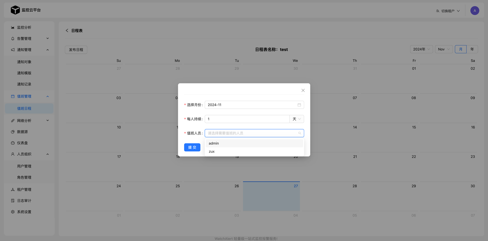
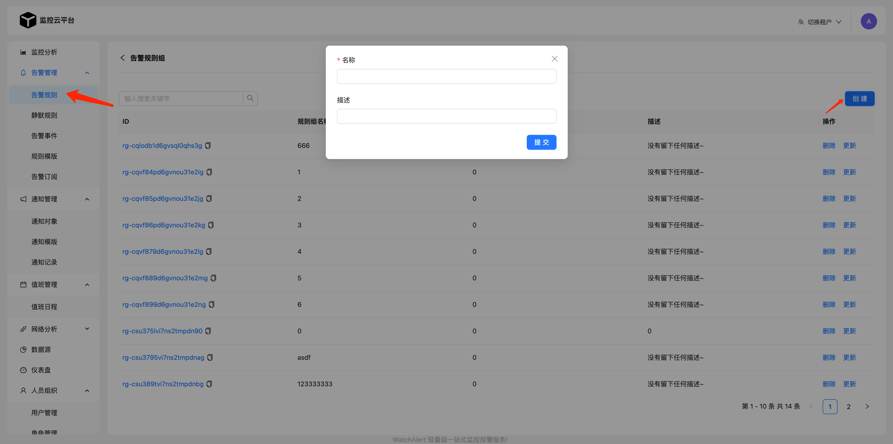

::: tip
当项目启动成功后，接下来跟着下方步骤验证下整个监控告警的流程；
:::

## 创建数据源
> 监控数据的来源。

## 创建值班表【可选】
> 用于通知到第三方平台时能够@相关负责人。

- 首先要在“用户管理”接受值班，并填写用户的UserId。

飞书：[获取UserId方法](https://blog.csdn.net/qq_37172634/article/details/123996775)

钉钉：填写手机号即可

- 创建值班表

## 创建通知对象
- 首先要有通知模版，默认系统会自带几个模版。可自行创建 or 调整模版。

- 创建对象
  - 【可选】绑定值班表

⚠️ 注意：如果使用钉钉`Hook`的话，需要在钉钉机器人中配置`“安全设置”`。
- 这里的关键字一定要和通知模版的关键字对应，尽量在钉钉侧配置通知模版的`Title`。

## 创建规则组/规则

- 点击“ID”进入规则组，创建规则

- 创建测试规则
  - 为了方便测试告警流程，我们采用`VictoriaMetric(Prometheus相同)`最简单的查询条件。
  - 持续时间: 1s
  - 执行频率: 1s

- 查询符合条件后，可以在告警事件中看到相应的事件内容，以及通知记录。最后就可以在第三方平台接收告警通知了。

