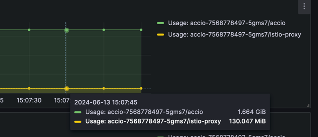

## 1. 背景
说到`istio`内存开销的问题必定是`istio proxy (Envoy)`出现了某种问题，导致资源使用率上升；

| 原因	    | 说明       |
| -------- |----------|
| Sidecar配置	|默认情况下，Sidecar拥有集群下所有服务的端点信息和相关配置。这部分配置会占有一定的内存。随着集群下部署的业务服务数增多，配置也会增多，导致内存变大。|
|实时请求的流量	|Envoy作为转发代理，会存在接收和响应的Buffer，以及一些请求的缓存队列，这些都会占用内存。|
|Metrics指标发散	|当Metrics指标发散时，占用的内存逐渐增多。|
|gRPC流控相关数据	|Sidecar的HTTP2解码器包含initial_stream_window_size和initial_connection_window_size两个参数，分别对应Sidecar在HTTP2编解码缓冲区中流级别的缓冲字节限制、连接级的缓冲字节限制。默认情况下，这两个参数被设定为256 MB。当服务的数据处理能力不足时，数据会在Sidecar内存中堆积，导致内存占用增长。|




## 2. 分析
envoy提供了admin api用于分析envoy代理的情况；

接口信息如下

```
127.0.0.1:15000
  /: Admin home page
  /certs: print certs on machine
  /clusters: upstream cluster status
  /config_dump: dump current Envoy configs (experimental)
  /contention: dump current Envoy mutex contention stats (if enabled)
  /cpuprofiler: enable/disable the CPU profiler
  /drain_listeners: drain listeners
  /healthcheck/fail: cause the server to fail health checks
  /healthcheck/ok: cause the server to pass health checks
  /heapprofiler: enable/disable the heap profiler
  /help: print out list of admin commands
  /hot_restart_version: print the hot restart compatibility version
  /init_dump: dump current Envoy init manager information (experimental)
  /listeners: print listener info
  /logging: query/change logging levels
  /memory: print current allocation/heap usage
  /quitquitquit: exit the server
  /ready: print server state, return 200 if LIVE, otherwise return 503
  /reopen_logs: reopen access logs
  /reset_counters: reset all counters to zero
  /runtime: print runtime values
  /runtime_modify: modify runtime values
  /server_info: print server version/status information
  /stats: print server stats
  /stats/prometheus: print server stats in prometheus format
  /stats/recentlookups: Show recent stat-name lookups
  /stats/recentlookups/clear: clear list of stat-name lookups and counter
  /stats/recentlookups/disable: disable recording of reset stat-name lookup names
  /stats/recentlookups/enable: enable recording of reset stat-name lookup names
```
查询已监听的节点信息
``` 
istio-proxy@cms-dc7bb999f-6f2hz:/$ curl -s 127.0.0.1:15000/stats | grep listener_manager
listener_manager.lds.update_attempt: 586
listener_manager.lds.update_failure: 283
listener_manager.lds.update_rejected: 0
listener_manager.lds.update_success: 302
listener_manager.lds.update_time: 1718262053968
listener_manager.lds.version: 8315844314034833010
listener_manager.listener_added: 71
listener_manager.listener_create_failure: 0
listener_manager.listener_create_success: 142   // 成功创建的Listener的数量。Listener是Envoy中的一个重要概念，它定义了Envoy如何监听和处理传入的连接请求。每当Envoy成功创建一个Listener时，该字段的计数器就会增加。
listener_manager.listener_in_place_updated: 0
listener_manager.listener_modified: 0
listener_manager.listener_removed: 8
listener_manager.listener_stopped: 0
listener_manager.total_filter_chains_draining: 0
listener_manager.total_listeners_active: 63
listener_manager.total_listeners_draining: 0
listener_manager.total_listeners_warming: 0
listener_manager.workers_started: 1
listener_manager.lds.update_duration: P0(nan,9) P25(nan,10.016891891891891) P50(nan,10.527027027027026) P75(nan,11.323529411764707) P90(nan,12.965714285714286) P95(nan,27.899999999999977) P99(nan,114.9000000000001) P99.5(nan,124.90000000000009) P99.9(nan,346.9799999999998) P100(nan,350)
```
查询已建立的后端集群节点信息
``` 
istio-proxy@cms-dc7bb999f-6f2hz:/$ curl -s 127.0.0.1:15000/stats | grep cluster_manager
cluster_manager.cds.version_text: "2024-06-13T04:12:41Z/622"
cluster_manager.active_clusters: 294
cluster_manager.cds.init_fetch_timeout: 0
cluster_manager.cds.update_attempt: 586
cluster_manager.cds.update_failure: 283
cluster_manager.cds.update_rejected: 0
cluster_manager.cds.update_success: 302
cluster_manager.cds.update_time: 1718262053939
cluster_manager.cds.version: 8315844314034833010
cluster_manager.cluster_added: 294  // 成功添加的Cluster的数量。Cluster是Envoy中用于连接到后端服务的一组主机的集合。当Envoy成功添加一个Cluster时，该字段的计数器就会增加。
cluster_manager.cluster_modified: 0
cluster_manager.cluster_removed: 0
cluster_manager.cluster_updated: 499
cluster_manager.cluster_updated_via_merge: 0
cluster_manager.update_merge_cancelled: 0
cluster_manager.update_out_of_merge_window: 88
cluster_manager.warming_clusters: 0
cluster_manager.cds.update_duration: P0(nan,18) P25(nan,20.325242718446603) P50(nan,21.166666666666668) P75(nan,24.65) P90(nan,27.26666666666667) P95(nan,42.89999999999998) P99(nan,234.90000000000006) P99.5(nan,284.9000000000001) P99.9(nan,306.9799999999998) P100(nan,310)
```

查询建立链接的端点信息
> 关键字：added_via_api::true
```
bash-5.1# curl -s 127.0.0.1:15000/clusters | grep 'outbound' | grep 'added_via_api::true' | wc -l
284
```
随着建立链接的增长，它会维护和处理这里链接那么istio-proxy消耗的资源就越多。

分析envoy资源分配情况
``` 
istio-proxy@pecms-689f747474-jw6tt:/$ curl -s 127.0.0.1:15000/memory
{
 "allocated": "38214264",   // Envoy已经从操作系统分配的内存量，这里是38214264字节，即37.7MB。
 "heap_size": "201990144",
 "pageheap_unmapped": "54132736",
 "pageheap_free": "0",
 "total_thread_cache": "21425744",
 "total_physical_bytes": "153493504"    // Envoy使用的物理内存总量，这里是153493504字节，即148.6MB。
}
```
得到的结果是envoy代理已分配的内存只有37M左右，但实际上istio-proxy使用的资源达到100M+，Envoy代理报告的已分配内存（allocated）和实际使用的物理内存（total_physical_bytes）之间存在差异。这可能是由于以下原因：

内存池管理：Envoy使用内存池来管理内存分配，这允许它重用内存块，从而减少实际分配给Envoy的内存量。

内存映射：Envoy可能使用内存映射文件来优化性能，这些文件在磁盘上占用空间，但在内存中可能不会占用太多。

内存碎片：操作系统可能已经分配了更多的内存，但由于内存碎片或其他原因，Envoy可能无法使用所有分配的内存。

其他进程或系统使用：虽然您检查的是Envoy的内存使用情况，但可能还有其他进程或系统组件也在使用内存，这可能会导致总的物理内存使用量超过Envoy报告的值。

> 通过如上分析得出结论，是`listener`和`cluster`越多，内存的开销就越大。 
> 
> 默认情况下`proxy`会维护整个集群的`listener`和`cluster`
> 
> 相关Issues：https://github.com/envoyproxy/envoy/issues/4196

## 3. 优化
### 3.1 按Namespace对配置进行隔离
Envoy 占用的内存与其配置中的 Listener 和 Cluster 数量成线性关系。通过减少 Pilot 为 Envoy 创建的 Listener 和 Cluster 的数量，可以降低 Envoy 的内存开销。例如：A Namesapce只维护（这里的维护是指proxy中维护的下游端点） B/C Namespace下的资源数据，即可完成对Envoy内存开销的优化。

示例
> Sidecar 资源允许你为特定的 Pod 定制 Istio 代理（Envoy）的行为
``` apiVersion: networking.istio.io/v1beta1
kind: Sidecar
metadata:
  name: default
  namespace: ztest
spec:
  egress:
  - hosts:
    - ./*   // 表示匹配当前命名空间 ztest 下的所有服务。
    - istio-system/*    // 表示匹配 istio-system 命名空间下的所有服务。
    - infra/*   // 表示匹配 infra 命名空间下的所有服务。
    - base/*    // 表示匹配 base 命名空间下的所有服务。
```
这样的话ztest环境下的proxy 只维护如上流量规则中所配置的服务流量，有效的降低Envoy的内存开销。
