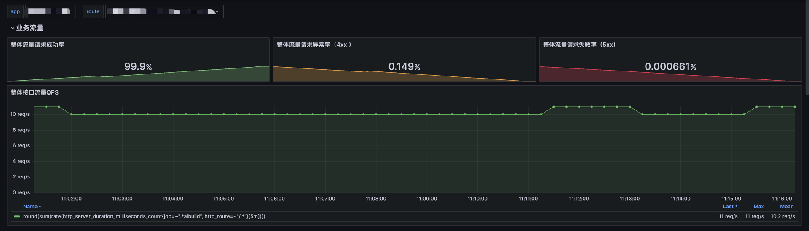
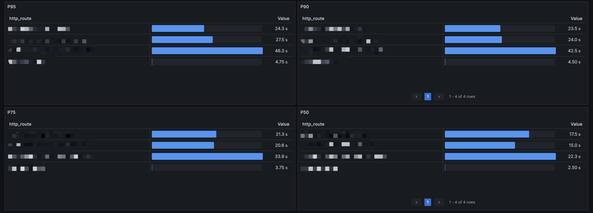
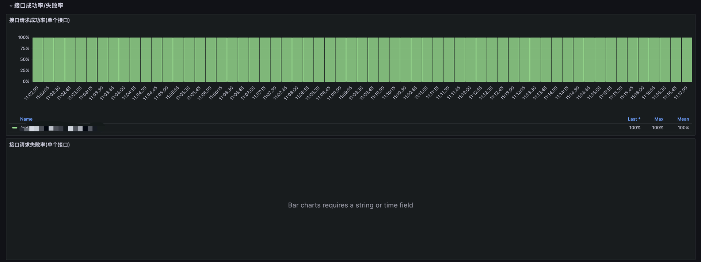
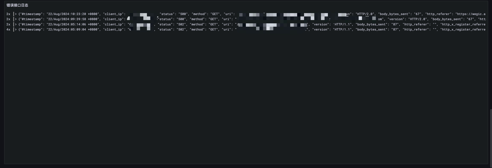

# 业务接口监控指标
业务监控，将流量的请求和服务日志进行结构化解析，生产监控指标数据图表。

## 用户流量统计
> 通过Loki日志分析
- `用户请求数`：统计在一定时间范围内的用户请求总数，通常用于衡量系统负载和流量趋势。
- `用户请求频次Top统计`：统计频繁访问系统的用户，识别活跃用户或潜在滥用行为。

## 接口状态
> 通过OpenTelemetry链路追踪分析
- `状态码分布数量`：统计不同状态码（如 200、404、500 等）的分布情况，分析接口成功率和异常率。
- `接口平均耗时[5m]`：每 5 分钟内接口请求的平均响应时间，用于分析系统响应的整体趋势。
``` 
sort_desc(rate(http_server_duration_milliseconds_sum{job=~"$app", http_route=~"$route", http_status_code!=""}[5m]) / rate(http_server_duration_milliseconds_count{job=~"$app", http_route=~"$route", http_status_code!=""}[5m])) 
```
- `P95、P90、P75、P50接口耗时分位`：分析不同百分位数的接口响应时间，识别大部分请求的性能表现及尾部延迟问题。
``` 
sort_desc(histogram_quantile(0.95, sum(rate(http_server_duration_milliseconds_bucket{job=~"$app", http_route!=""}[5m]))by (le, http_route)))
```

## 业务服务流量
> 通过OpenTelemetry链路追踪分析（需要将Span数据转换成Metric），可以反映出后端服务的负载情况
- `具体接口吞吐流量 RPS`：用于分析具体服务承载的请求量。
``` 
sort_desc(sum(rate(http_server_duration_milliseconds_count{job=~"$app",http_route=~"$route"}[5m])) by(http_route))
```
- `整体流量请求成功率(200)`：整体流量中成功请求的占比，分析整体服务质量。
```
sum(http_server_duration_milliseconds_count{job=~"service",http_status_code=~"2.*|1.*|3.*"}) / sum(http_server_duration_milliseconds_count{job=~"service"})
```
- `整体流量请求异常率(4xx)`：整体流量中返回`4xx`状态码的请求占比，反映客户端错误的比例。
```
sum(http_server_duration_milliseconds_count{job=~"service",http_status_code=~"4.*"}) / sum(http_server_duration_milliseconds_count{job=~"service"})
```
- `整体流量请求失败率(5xx)`：整体流量中返回`5xx`状态码的请求占比，分析服务端错误的发生频率。
```
sum(http_server_duration_milliseconds_count{job=~"service",http_status_code=~"4.*"}) / sum(http_server_duration_milliseconds_count{job=~"service"})
```


## 业务服务运行状态
> 通过`log2metric-exporter`实现分析业务服务Error日志；
- `分析Error错误日志的增长率`：反映出过去某一时间内与另一段时间相比，最近的时间内，error增长百分之多少。
``` 
 (rate(l2m_level_info{level="ERROR"}[5m]) - rate(l2m_level_info{level="ERROR"}[10m] offset 5m)) / rate(l2m_level_info{level="ERROR"}[10m] offset 5m) * 100 > 50
```
- `分析Error错误日志的占比`：反映出过去某一时间内错误日志占总请求的百分之多少。
``` 
sum(increase(l2m_level_info{level="ERROR"}[10m])) by (service) / sum(increase(l2m_level_info[10m])) by (service) * 100 > 1
```

## 监控大盘
[DashBoard JSON](./dashboard.json)





