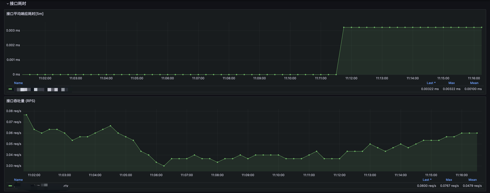

# 业务监控指标
业务监控，将流量的请求和服务日志进行结构化解析，生产监控指标数据图表。

## 用户流量统计
> 通过Loki日志分析
- `用户请求数`：统计在一定时间范围内的用户请求总数，通常用于衡量系统负载和流量趋势。
- `用户请求频次Top统计`：统计频繁访问系统的用户，识别活跃用户或潜在滥用行为。

## 接口状态
> 通过OpenTelemetry链路追踪分析
- `状态码分布数量`：统计不同状态码（如 200、404、500 等）的分布情况，分析接口成功率和异常率。
- `接口平均耗时[5m]`：每 5 分钟内接口请求的平均响应时间，用于分析系统响应的整体趋势。
- `接口吞吐量(RPS)`：每秒请求数（Requests Per Second），衡量系统的处理能力。
  - 需要将Span数据转换成Metric
- `接口请求成功率(200)`：统计返回状态码为`200`的请求占总请求数的比例。
- `接口请求失败率(5xx)`：统计返回`5xx`错误的请求占总请求数的比例，衡量接口的稳定性。
- `接口错误状态码日志`：收集并展示返回非`200`状态码的请求日志，便于排查错误。
- `P95、P90、P75、P50接口耗时分位`：分析不同百分位数的接口响应时间，识别大部分请求的性能表现及尾部延迟问题。

## 业务流量
> 通过OpenTelemetry链路追踪分析
- `整体接口流量QPS`：整体系统的每秒请求数，用于衡量系统的流量负载。
- `整体流量请求成功率(200)`：整体流量中成功请求的占比，分析整体服务质量。
- `整体流量请求异常率(4xx)`：整体流量中返回`4xx`状态码的请求占比，反映客户端错误的比例。
- `整体流量请求失败率(5xx)`：整体流量中返回`5xx`状态码的请求占比，分析服务端错误的发生频率。

## 监控大盘
[DashBoard JSON](./dashboard.json)

