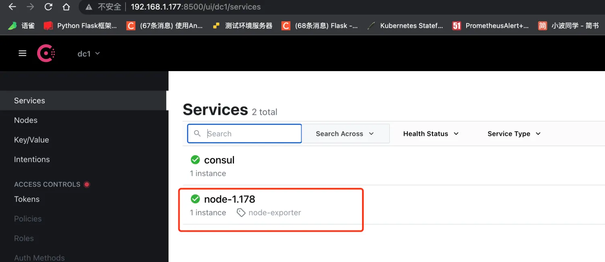
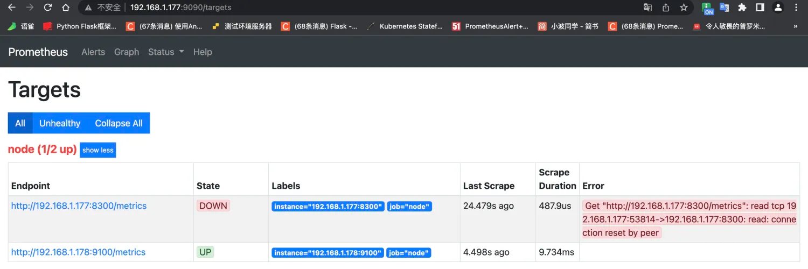
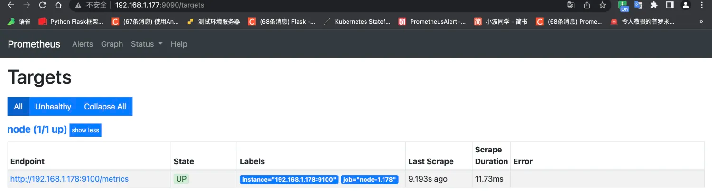

# 服务发现
## 基于文件
基于文件的自动发现，即`<file_sd_config>`

### 服务配置文件
``` 
scrape_configs:
  - job_name: 'file_ds'   #此处定义了自动发现的采集任务名称，可以依据自己的业务定义多个自动发现任务
    file_sd_configs:
      - files:
        - targets/*.json         #采集文件路径
        refresh_interval: 5m #自动发现间隔时间，默认5m
```
### 自动发现文件
`target.json`文件包含的项与`prometheus.yml`的配置文件中`job_name.static_configs`的项一致(可配置通配)，用户可以为每组targets加labels，便于告警分组、告警抑制时使用;

示例如下：
``` 
[
   {
      "targets": [
         "172.16.0.96:19100"
      ],
      "labels": {
         "project_name": "项目测试20200413",
         "env_name": "开发环境",
         "soft_name": "测试应用20200413",
         "template_name": "测试模板20200413",
         "template_type": "主机模板"
      }
   },
 	 {
      "targets": [
         "172.16.0.96:30013",
         "172.16.0.96:30015"
      ],
      "labels": {
         "project_name": "项目测试20200413",
         "env_name": "开发环境",
         "soft_name": "测试应用20200413",
         "template_name": "测试模板20200413",
         "template_type": "主机模板"
      }
   },
	 {
      "metrics_path": "/_prometheus/metrics",
      "targets": [
         "172.16.0.96:9200"
      ],
      "labels": {
         "project_name": "项目测试20200413",
         "env_name": "开发环境",
         "soft_name": "测试应用20200413",
         "template_name": "测试模板20200413",
         "template_type": "主机模板"
      }
   }
]
```

## 基于Kubernetes
`kubernetes_sd_configs`支持监控其集群中各种资源对象。`kubernetes SD`配置允许从`kubernetes REST API`接收搜集指标，并且和集群保持同步状态，任何一种`role`类型都能通过配置来发现我们想要的资源对象。
### 五种服务发现配置模式
`Prometheus`通过`kubernetes API`集成主要支持五种服务发现配置模式：`Node`、`Service`、`Pod`、`Endpoints`、`Ingress`。

例如：
- `Node`适用于与主机相关的资源监控，如节点种运行的`kubernetes`组件状态、节点上运行的容器状态等。 
- `service`和`ingress`适用于通过黑盒监控的场景，如对服务的可用性以及服务质量的监控。 
- `endpoints`和`pod`适用于获取pod实例的数据监控。

### 规则解析
- [Configuration | Prometheus](https://prometheus.io/docs/prometheus/latest/configuration/configuration/)

解决服务发现的问题，我们可以通过添加额外的配置来进行服务发现的自动监控。 

在Service或Pod的annotations中添加如下配置即可实现Prometheus服务发现。
``` 
  annotations:
	# 新增如下配置
    prometheus.io/port: "3002"	# 可自动注册的端口
    prometheus.io/scrape: "true"	# 是否自动注册
```
### sd_config示例
``` 
# Kubernetes的API SERVER会暴露API服务，Promethues集成了对Kubernetes的自动发现，它有5种模式：Node、Service
# 、Pod、Endpoints、ingress，下面是Prometheus官方给出的对Kubernetes服务发现的实例。这里你会看到大量的relabel_configs，
# 其实你就是把所有的relabel_configs去掉一样可以对kubernetes做服务发现。relabel_configs仅仅是对采集过来的指标做二次处理，比如
# 要什么不要什么以及替换什么等等。而以__meta_开头的这些元数据标签都是实例中包含的，而relabel则是动态的修改、覆盖、添加删除这些标签
# 或者这些标签对应的值。而且以__开头的标签通常是系统内部使用的，因此这些标签不会被写入样本数据中，如果我们要收集这些东西那么则要进行
# relabel操作。当然reabel操作也不仅限于操作__开头的标签。


global:
  # 间隔时间
  scrape_interval: 30s
  # 超时时间
  scrape_timeout: 10s
  # 另一个独立的规则周期，对告警规则做定期计算
  evaluation_interval: 30s
  # 外部系统标签
  external_labels:
    prometheus: monitoring/k8s
    prometheus_replica: prometheus-k8s-1

# 抓取服务端点，整个这个任务都是用来发现node-exporter和kube-state-metrics-service的，这里用的是endpoints角色，这是通过这两者的service来发现
# 的后端endpoints。另外需要说明的是如果满足采集条件，那么在service、POD中定义的labels也会被采集进去
scrape_configs: 
  # 定义job名称，是一个拉取单元 
- job_name: "kubernetes-endpoints"
  # 发现endpoints，它是从列出的服务端点发现目标，这个endpoints来自于Kubernetes中的service，每一个service都有对应的endpoints，这里是一个列表
  # 可以是一个IP:PORT也可以是多个，这些IP:PORT就是service通过标签选择器选择的POD的IP和端口。所以endpoints角色就是用来发现server对应的pod的IP的
  # kubernetes会有一个默认的service，通过找到这个service的endpoints就找到了api server的IP:PORT，那endpoints有很多，我怎么知道哪个是api server呢
  # 这个就靠source_labels指定的标签名称了。
  kubernetes_sd_configs:
    # 角色为 endpoints
    - role: endpoints
    # 指定 namespace 名称空间
      namespaces:
        names:
        - httpserver	# namespace Name
  # 下面的含义是源标签__meta_kubernetes_namespace等如果其值为default;kubernetes;https标签顺序和值要对应。换句话说就是
  # 当__meta_kubernetes_namespace, __meta_kubernetes_service_name, __meta_kubernetes_endpoint_port_name三者对应的
  # 值为default、kubernetes、https则进行保留，而且该endpoints对应的地址为api server的地址。
  #
  # __meta_kubernetes_namespace 端点对象的命名空间，在不同对象上这个标签的含义不同，在角色是endpoints中这个是端点对象的名称空间
  # __meta_kubernetes_service_name 端点对象的服务名称
  # __meta_kubernetes_endpoint_port_name 端点的端口名称
  #
  # kubernetes默认在default名称空间有一个叫做kubernetes的service，所以这个service的有3个设置对应的就是下面三个标签
  # __meta_kubernetes_namespace 值为default
  # __meta_kubernetes_service_name 值为kubernetes
  # __meta_kubernetes_endpoint_port_name 值为https
  relabel_configs:
    # 重新打标仅抓取到的具有 "prometheus.io/scrape: true" 的annotation的端点，意思是说如果某个service具有prometheus.io/scrape = true annotation声明则抓取
 # annotation本身也是键值结构，所以这里的源标签设置为键，而regex设置值，当值匹配到regex设定的内容时则执行keep动作也就是保留，其余则丢弃.
 # node-exporter这个POD的service里面就有一个叫做prometheus.io/scrape = true的annotations所以就找到了node-exporter这个POD
    - source_labels: [__meta_kubernetes_service_annotation_prometheus_io_scrape]
      # 动作 删除 regex 与串联不匹配的目标 source_labels
      action: keep
      # 通过正式表达式匹配 true
      regex: true
    # 重新设置scheme
 # 匹配源标签__meta_kubernetes_service_annotation_prometheus_io_scheme也就是prometheus.io/scheme annotation
 # 如果源标签的值匹配到regex则把值替换为__scheme__对应的值
    - source_labels: [__meta_kubernetes_service_annotation_prometheus_io_scheme]
      action: replace
      target_label: __scheme__
      regex: (https?)
    # 匹配来自 pod annotationname prometheus.io/path 字段
    - source_labels: [__meta_kubernetes_service_annotation_prometheus_io_path]
      # 获取POD的 annotation 中定义的"prometheus.io/path: XXX"定义的值，这个值就是你的程序暴露符合prometheus规范的metrics的地址
   # 如果你的metrics的地址不是 /metrics 的话，通过这个标签说，那么这里就会把这个值赋值给 __metrics_path__这个变量，因为prometheus
      # 是通过这个变量获取路径然后进行拼接出来一个完整的URL，并通过这个URL来获取metrics值的，因为prometheus默认使用的就是 http(s)://X.X.X.X/metrics
      # 这样一个路径来获取的。
      action: replace
      # 匹配目标指标路径
      target_label: __metrics_path__
      # 匹配全路径
      regex: (.+)
    # 匹配出 Pod ip地址和 Port
    - source_labels:
        [__address__, __meta_kubernetes_service_annotation_prometheus_io_port]
      action: replace
      target_label: __address__
      regex: ([^:]+)(?::\d+)?;(\d+)
      replacement: $1:$2
    # 下面主要是为了给样本添加额外信息
    - action: labelmap
      regex: __meta_kubernetes_service_label_(.+)
    # 元标签 服务对象的名称空间
    - source_labels: [__meta_kubernetes_namespace]
      action: replace
      target_label: kubernetes_namespace
    # service 对象的名称
    - source_labels: [__meta_kubernetes_service_name]
      action: replace
      target_label: kubernetes_name
    # pod对象的名称
    - source_labels: [__meta_kubernetes_pod_name]
      action: replace
      target_label: kubernetes_pod_name
```

## 基于Consul
即`consul_sd_configs`
### 部署Consul
``` 
version: '3'
services:
  consul:
    image: consul:1.15.4
    ports:
      - "8500:8500"
      - "8600:8600"
      - "8300-8302:8300-8302"
    volumes:
      - /data/consul/data:/consul/data
    command: consul agent -server -bootstrap-expect 1 -data-dir=/consul/data -node=consul-server1 -bind=192.168.1.177 -client=0.0.0.0 -ui
    network_mode: host
```
### 注册服务
``` 
[root@vm-1-177 consul]# vi /data/consul/consul-node.json
{
  "ID": "node-1.178",
  "Name": "node-1.178",
  "Tags": ["node-exporter"],
  "Address": "192.168.1.178",
  "Port": 9100,
  "Check": {
    "HTTP": "http://192.168.1.178:9100/metrics",
    "Interval": "5s"
  }
}

[root@vm-1-177 consul]# curl --request PUT --data @/data/consul/consul-node.json http://192.168.1.177:8500/v1/agent/service/register?replace-existing-checks=1
```


### 配置服务发现
配置`Prometheus`来使用`Consul`自动服务发现，目的就是能够将上边添加的服务自动发现到`Prometheus`的`Targets`中

配置如下：
``` 
...
- job_name: 'consul-prometheus'
  consul_sd_configs:
  - server: '192.168.1.177:8500'
    services: []  
```
这里需要使用`consul_sd_configs`来配置使用`Consul`服务发现类型，`server`为`Consul`的服务地址，这里跟上边要对应上。 配置完毕后，重启`Prometheus`服务，此时可以通过`Prometheus UI`页面的`Targets`下查看是否配置成功。

可以看到，在`Targets`中能够成功的自动发现`Consul`中的`Services`信息，后期需要添加新的`Targets`时，只需要通过`API`往`Consul`中注册服务即可，`Prometheus`就能自动发现该服务，是不是很方便。

**问题**

- 会发现`Prometheus`同时加载出来了默认服务`consul`，这个是不需要的。
- 默认只显示`job`及`instance`两个标签，其他标签都默认属于`before relabeling`下，有些必要的服务信息，也想要在标签中展示，该如何操作呢？
- 如果需要自定义一些标签，例如 `team、group、project` 等关键分组信息，方便后边 alertmanager 进行告警规则匹配，该如何处理呢？
- 所有`Consul`中注册的`Service`都会默认加载到`Prometheus`下配置的`consul_prometheus`组，如果有多种类型的`exporter`，如何在`Prometheus`中配置分配给指定类型的组，方便直观的区别它们？

以上问题，我们可以通过`Prometheus`配置中的`relabel_configs`参数来解决。

**过滤无用label**

这里的`relabel_configs`配置作用为丢弃源标签中`__meta_consul_service`包含`consul`标签的服务，`__meta_consul_tags`对应到`Consul`服务中的值为 `"tags": ["node"]`，默认 `consul` 服务是不带该标签的，从而实现过滤;重启服务就会只显示咱们注册的服务了；
``` 
[root@vm-1-177 consul]# vi /opt/prometheus/prometheus.yml
···
  - job_name: 'node'
    consul_sd_configs:
      - server: '192.168.1.177:8500'
    relabel_configs:
      - source_labels: [__meta_consul_service]
        regex: .*consul.*
        action: drop
      - source_labels: [__meta_consul_service]
        target_label: job
```


### 注销服务

``` 
[root@vm-1-177 consul]# consul services deregister -id {id-name}
2022-04-18T18:09:41.082+0800 [INFO]  agent: Deregistered service: service=node-1.178
Deregistered service: node-1.178
```