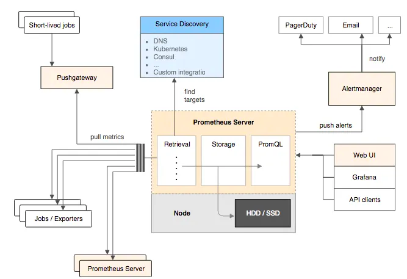
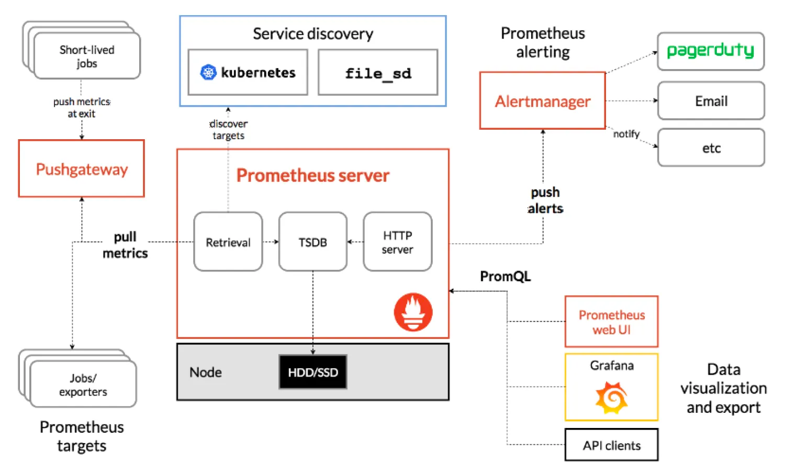

# Prometheus
## 简介
Prometheus受启发于Google的Brogmon监控系统（相似的Kubernetes是从Google的Brog系统演变而来），从2012年开始由前Google工程师在Soundcloud以开源软件的形式进行研发，并且于2015年早期对外发布早期版本。2016年5月继Kubernetes之后成为第二个正式加入CNCF基金会的项目，同年6月正式发布1.0版本。2017年底发布了基于全新存储层的2.0版本，能更好地与容器平台、云平台配合。

## 优势
- 多维数据模型:   使用metric名和键值对来区分的时间序列和数据.
- 灵活强大的查询语言支持
- 单节点部署,不依赖于分布式存储
- 数据采集器基于HTTP协议,使用PULL模式获取数据.
- 扫描目标与告警管理支持静态配置与动态服务发现
- 可使用PushGateway推送时间序列数据至Prometheus Server
- 内置Dashboard用于基本功能查看和管理.

## 组件及生态
- Prometheus Server

  Prometheus Server是Prometheus组件中的核心部分，负责实现对监控数据的获取，存储以及查询。 Prometheus Server可以通过静态配置管理监控目标，也可以配合使用Service Discovery的方式动态管理监控目标，并从这些监控目标中获取数据。其次Prometheus Server需要对采集到的监控数据进行存储，Prometheus Server本身就是一个时序数据库，将采集到的监控数据按照时间序列的方式存储在本地磁盘当中。最后Prometheus Server对外提供了自定义的PromQL语言，实现对数据的查询以及分析。

- Exporter
  
  Exporter将监控数据采集的端点通过HTTP服务的形式暴露给Prometheus Server，Prometheus Server通过访问该Exporter提供的Endpoint端点，即可获取到需要采集的监控数据。

- AlertManager

  在Prometheus Server中支持基于PromQL创建告警规则，如果满足PromQL定义的规则，则会产生一条告警，而告警的后续处理流程则由AlertManager进行管理。在AlertManager中我们可以与邮件，Slack等等内置的通知方式进行集成，也可以通过Webhook自定义告警处理方式。AlertManager即Prometheus体系中的告警处理中心。

- PushGateway

  短期存储指标数据，用于临时性的任务，各个目标主机可以上报数据到Pushgateway，然后Prometheus Server统一从Pushgateway上拉去数据。

  Prometheus默认是通过exporter主动获取数据（默认采取pull拉取数据），Pushgateway则是通过被动方式推送数据到Prometheus Server，用户可以写自定义的监控脚本把需要监控的数据发送给Pushgateway，然后pushgateway再把数据发送给Prometheus Server。

## 架构


Prometheus的基本原理是通过HTTP协议周期性抓取被监控组件的状态，任意组件只要提供对应的HTTP接口就可以接入监控。不需要任何SDK或者其他的集成过程。这样做非常适合做虚拟化环境监控系统，比如VM、Docker、Kubernetes等。输出被监控组件信息的HTTP接口被叫做exporter 。目前互联网公司常用的组件大部分都有exporter可以直接使用，比如Varnish、Haproxy、Nginx、MySQL、Linux系统信息(包括磁盘、内存、CPU、网络等等).

## 服务过程
Prometheus服务过程大概是这样:
- Prometheus Daemon负责定时去目标上抓取metrics(指标)数据，每个抓取目标需要暴露一个http服务的接口给它定时抓取。Prometheus支持通过配置文件、文本文件、Zookeeper、Consul、DNS SRV Lookup等方式指定抓取目标。Prometheus采用PULL的方式进行监控，即服务器可以直接通过目标PULL数据或者间接地通过中间网关来Push数据。
- Prometheus在本地存储抓取的所有数据，并通过一定规则进行清理和整理数据，并把得到的结果存储到新的时间序列中。
- Prometheus通过PromQL和其他API可视化地展示收集的数据。Prometheus支持很多方式的图表可视化，例如Grafana、自带的Promdash以及自身提供的模版引擎等等。Prometheus还提供HTTP API的查询方式，自定义所需要的输出。
- PushGateway支持Client主动推送metrics到PushGateway，而Prometheus只是定时去Gateway上抓取数据。
- Alertmanager是独立于Prometheus的一个组件，可以支持Prometheus的查询语句，提供十分灵活的报警方式。

## 部署

### Docker-Compsose
#### Prometheus Server
目录结构
``` 
[root@jsdesign01 prometheus]# mkdir -p /opt/apps/monitoring/prometheus/{data,rules}
[root@jsdesign01 prometheus]# chmod 777 -R /opt/apps/monitoring/prometheus/{data,rules} 
[root@jsdesign01 prometheus]# pwd
/opt/apps/monitoring/prometheus
[root@jsdesign01 prometheus]# tree
.
├── data
├── docker-compose.yaml
├── prometheus.yml
└── rules
    └── first_rules.yml

```
yaml
``` 
version: "3"
services:
  prometheus:
    container_name: prometheus
    image: registry.js.design/prometheus/prometheus:v2.32.1
    ports:
      - 9090:9090
    volumes:
      - /opt/apps/monitoring/prometheus/prometheus.yml:/etc/prometheus/prometheus.yml
      - /opt/apps/monitoring/prometheus/data:/prometheus
      - /opt/apps/monitoring/prometheus/rules/:/etc/prometheus/rules/
      - /etc/localtime:/etc/localtime:ro
    restart: always
    command: 
      - '--config.file=/etc/prometheus/prometheus.yml'
      - '--web.enable-admin-api'
      - '--web.enable-lifecycle'
      - '--storage.tsdb.retention=15d'
      - '--storage.tsdb.path=/prometheus'
    networks:
      - monitor

networks:
  monitor:
    driver: bridge
```
**参数**

- `--storage.tsdb.path`：数据存储位置，默认是data目录。
- `--storage.tsdb.retention.time`：保留时间，默认是15天，过15天之后，就删除。该配置会覆盖--storage.tsdb.retention的值。
- `--storage.tsdb.retention.size`：要保留的块的最大字节数。最早的数据会首先被删除。默认为0或禁用。
磁盘的最小尺寸取决于：wal目录（wal和checkpoint）和chunks_head目录（m-mapped head chunks）的峰值空间（每2小时会达到一次峰值，然后从内存中初始化到本地存储）。
- `--storage.tsdb.wal-compression`：开启预写日志的压缩。
- `--web.enable-lifecycle`：热加载配置。'curl -X POST http://url:9090/-/reload'

**服务配置**
``` 
global:
  scrape_interval: 5s 
  evaluation_interval: 5s
  # 全局标签组
  # 通过本实例采集的数据都会叠加下面的标签
  external_labels:
    account: "huawei-main"
    region: "beijing"

alerting:
  alertmanagers:
  - static_configs:
    - targets:
      - '172.17.84.238:9093'

rule_files:
  - "/etc/prometheus/rules/first_rules.yml"

scrape_configs:
  - job_name: "prometheus"
    static_configs:
      - targets: ["localhost:9090"]
      - targets: ["172.17.84.238:9100"]
```

**规则配置**
``` 
groups:
# --- Node
- name: NodeStatus   # 报警规则组名称
  rules:
  - alert: Exporter Componen is Down
    expr: up == 0
    for: 2m  #持续时间,表示持续30秒获取不到信息，则触发报警
    labels:
      severity: serious  # 自定义标签 严重的
    annotations:
      summary: "节点: {{ $labels.instance }} Exporter 程序" # 自定义摘要
      description: "节点: {{ $labels.instance }} Exporter程序异常 请及时处理！." # 自定义具体描述
```

#### Node Exporter
**目录结构**

```
[root@jsdesign01 monitoring]# mkdir -p /opt/apps/monitoring/exporter
[root@jsdesign01 exporter]# tree
.
└── docker-compose.yaml

0 directories, 1 file
```

yaml
``` 
version: '3'
services:
  node-exporter:
    container_name: "node-exporter"
    image: registry.js.design/prometheus/node-exporter:v1.0.1
    restart: "always"
    ports:
      - 9100:9100
    volumes:
      - "/proc:/host/proc:ro"
      - "/sys:/host/sys:ro"
      - "/:/rootfs:ro"
      - /etc/localtime:/etc/localtime
```

### Kubernetes 
安全认证
> 用于通过k8s自动发现来监控pod、node等相关指标。
``` 
apiVersion: v1
kind: ServiceAccount
metadata:
  namespace: monitor
  name: prometheus
---
apiVersion: rbac.authorization.k8s.io/v1
kind: ClusterRoleBinding
metadata:
  name: prometheus
roleRef:
  apiGroup: rbac.authorization.k8s.io
  kind: ClusterRole
  name: cluster-admin
subjects:
  - kind: ServiceAccount
    namespace: monitor
    name: prometheus
---
apiVersion: v1
kind: Secret
metadata:
  name: prometheus
  namespace: monitor
  annotations:
    kubernetes.io/service-account.name: "prometheus"
type: kubernetes.io/service-account-token
```
服务配置
``` 
apiVersion: v1
kind: "Service"
metadata:
  name: prometheus
  namespace: monitor
  labels:
    name: prometheus
spec:
  ports:
  - name: prometheus
    protocol: TCP
    nodePort: 30909
    port: 9090
    targetPort: 9090
  selector:
    app: prometheus
  type: NodePort
---
apiVersion: apps/v1
kind: Deployment
metadata:
  labels:
    name: prometheus
  name: prometheus
  namespace: monitor
spec:
  replicas: 1
  selector:
    matchLabels:
      app: prometheus
  template:
    metadata:
      labels:
        app: prometheus

    spec:
      serviceAccountName: prometheus
      serviceAccount: prometheus

      tolerations:
      - key: "proxy"
        operator: "Equal"
        value: "true"
        effect: "NoSchedule"

      nodeSelector:
        dedicated: monitor

      containers:
      - name: prometheus
        image: bitnami/prometheus:2.46.0
        securityContext:
          runAsUser: 0
        args:
        - "--web.enable-admin-api"
        - "--web.enable-lifecycle"
        - "--config.file=/etc/prometheus/prometheus.yml"
        - "--web.enable-remote-write-receiver"
        - "--storage.tsdb.retention=14d"

        ports:
        - containerPort: 9090
          protocol: TCP
        volumeMounts:
        - mountPath: "/etc/prometheus"
          name: prometheus-config
        - mountPath: "/prometheus"
          name: data

      volumes:
      - name: data
        hostPath:
          path: /data/prometheus
          type: DirectoryOrCreate

      - name: prometheus-config
        configMap:
          name: prometheus-config
```
端点配置
``` 
apiVersion: v1
kind: ConfigMap
metadata:
  name: prometheus-config
  namespace: monitor
data:
  prometheus.yml: |-
    scrape_configs:

    - job_name: 'kubernetes-kubelets'
      kubernetes_sd_configs:
        - role: node
      relabel_configs:
        - source_labels: [__address__]
          regex: '(.*):10250'
          replacement: '${1}:9100'
          target_label: __address__
          action: replace
        - action: labelmap
          regex: __meta_kubernetes_node_label_(.+)
```

## 远端存储
### VictoraMetircs
将以下行添加到 Prometheus 配置文件（通常位于/etc/prometheus/prometheus.yml）中，以便将数据发送到 VictoriaMetrics：
> 建议将 Prometheus 升级到v2.12.0或更高版本，因为以前的版本可能存在remote_write
``` 
remote_write:
- url: http://<victoriametrics-addr>:8428/api/v1/write
```

Prometheus 将传入数据写入本地存储，并并行将其复制到远程存储。这意味着--storage.tsdb.retention.time即使远程存储不可用，数据在本地存储中仍然可用。

#### 场景1, HA多个配置不同的`Prometheus`实例

如果您计划从多个 Prometheus 实例向 VictoriaMetrics 发送数据，请将以下行添加到Prometheus config
>global部分： 
> 这是必须的，因为要区分不同实例的数据。

``` 
global:
  external_labels:
    datacenter: dc-123
```
`datacenter=dc-123`这指示 Prometheus在将每个样本发送到远程存储之前为其添加标签。标签名称可以是任意的 -datacenter这只是一个例子。标签值在 Prometheus 实例中必须是唯一的，因此可以通过该标签对时间序列进行过滤和分组。


#### 场景2, HA多个配置相同的`Prometheus`实例
如果HA对中多个配置相同的`Prometheus`实例将数据写入同一个`VictoriaMetrics`实例，则重复数据删除可减少磁盘空间使用量。这些`Prometheus`实例的配置中必须具有相同的`external_labels`部分，因此它们将数据写入相同的时间序列。

VM存储开启数据去重
> 默认不去重
> 
> https://docs.victoriametrics.com/#deduplication

多个实例推送相同的数据时，配置vmstorage的`-dedup.minScrapeInterval=scrape_interval`，这样可以防止VM存储相同的数据；

建议的值`-dedup.ninscrapeInterval`必须等于`scrape_interval`Prometheus配置中的配置。建议`scrape_interval`在所有抓取目标中都使用一个值，保证一个间隔仅存储一个sample。

#### 高负载优化

对于高负载的 Prometheus 实例（每秒 200k+ 样本），可以应用以下调整：

``` 
remote_write:
  - url: http://<victoriametrics-addr>:8428/api/v1/write
    queue_config:
      max_samples_per_send: 10000
      capacity: 20000
      max_shards: 30
```
参数
- `max_samples_per_send`：每次发送的最大样本数。这里设置为 10000，表示 Prometheus 每次最多发送 10000 个样本到远程存储。
- `capacity`：队列的最大容量，表示在内存中保存的样本数量。这里设置为 20000，表示 Prometheus 在内存中最多可以缓存 20000 个样本。
- `max_shards`：最大并发 shard（分片）数量。这里设置为 30，表示 Prometheus 在发送数据到远程存储时，最多可以使用 30 个并发 shard。这有助于提高数据发送的吞吐量。


使用远程写入会使 Prometheus 的内存使用量增加高达约 25%。如果您遇到 Prometheus 内存消耗过高的问题，请尝试降低max_samples_per_send和capacityparams。请记住，这两个参数是紧密相连的。在[此处阅读](https://prometheus.io/docs/practices/remote_write/)有关调整 Prometheus 远程写入的更多信息。 
  