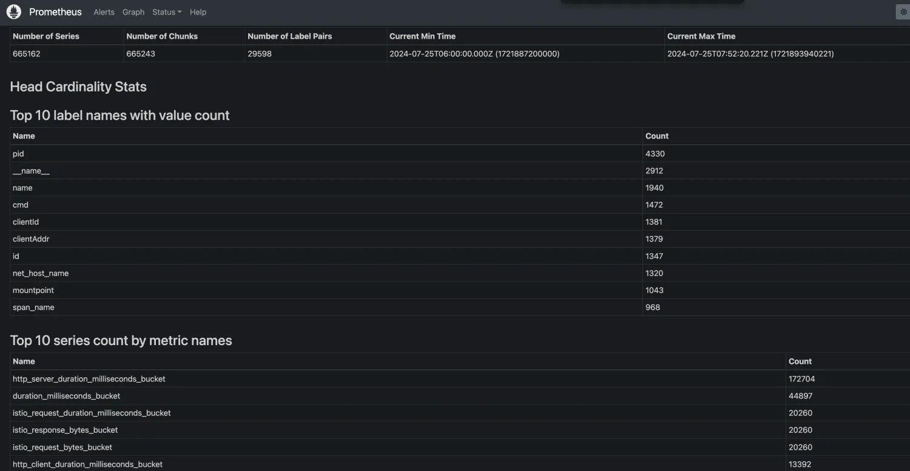

# Prometheus 大内存性能分析及优化

## 分析
随着Prometheus采集的Metrics随之增多，很容易对Prometheus Server造成消耗大内存的现象。

之所以出现大内存，问题来源于它自身存储原理：
`Prometheus`按`2小时(默认)`一个`block`进行存储，每个`block`由一个目录组成，该目录里包含：一个或者多个`chunk`文件（保存timeseries数据）、一个`metadata`文件、一个`index`文件（通过`metric name`和`labels`查找`timeseries`数据在`chunk`文件的位置）。
最新写入的数据保存在内存`block`中，达到2小时后写入磁盘。为了防止程序崩溃导致数据丢失，实现了WAL（write-ahead-log）机制，启动时会以写入日志(WAL)的方式来实现重播，从而恢复数据。
删除数据时，删除条目会记录在独立的`tombstone`文件中，而不是立即从`chunk`文件删除。

内存中的block数据未写入磁盘时，block目录下面主要保存wal文件:
``` 
./data/01BKGV7JBM69T2G1BGBGM6KB12
./data/01BKGV7JBM69T2G1BGBGM6KB12/meta.json
./data/01BKGV7JBM69T2G1BGBGM6KB12/wal/000002
./data/01BKGV7JBM69T2G1BGBGM6KB12/wal/000001
```
持久化的`block`目录下`wal`文件被删除，`timeseries`数据保存在`chunk`文件里。`index`用于索引`timeseries`在`wal`文件里的位置。
``` 
./data/01BKGV7JC0RY8A6MACW02A2PJD
./data/01BKGV7JC0RY8A6MACW02A2PJD/meta.json
./data/01BKGV7JC0RY8A6MACW02A2PJD/index
./data/01BKGV7JC0RY8A6MACW02A2PJD/chunks
./data/01BKGV7JC0RY8A6MACW02A2PJD/chunks/000001
./data/01BKGV7JC0RY8A6MACW02A2PJD/tombstones
```
结论：
- `prometheus`按照`block`块的方式来存储数据，默认每2小时为一个时间单位，首先会存储到内存中，所以会导致Prom占用内存过。当到达2小时后，会自动写入磁盘中；
- 加载历史数据时，是从磁盘到内存的，查询范围越大，内存越大；
- 不合理的查询也会消耗大内存，如rate大范围的数据；

## 优化方案
### 调整指标抓取时间间隔
以获取少量的样本来达到内存优化的效果，但一般情况下针对不是特别重要的Metrics来执行
``` 
- job_name: ElasticSearch
  honor_timestamps: true
  scrape_interval: 5m	 // 抓取频率
  scrape_timeout: 10s
  metrics_path: /metrics
  scheme: http
  follow_redirects: true
  enable_http2: true
  static_configs:
    - targets:
      - elasticsearch-exporter.monitor:9114
```

### 减少大范围查询
在查询/配置Grafana大盘时，尽量减少大范围查询。
``` 
rate(up[1m])
```

### 调整数据落盘时间
#### 块存储配置
`Prometheus` 会定期将数据写入磁盘上的块文件，这些文件在内存中缓冲一定时间后会被持久化。默认情况下，`Prometheus` 每`2 小时`会创建一个新的块文件。
**配置参数**
- `--storage.tsdb.min-block-duration`: 最小块文件持续时间，默认是 2 小时（2h）。
- `--storage.tsdb.max-block-duration`: 最大块文件持续时间，通常不需要调整，保持与最小块持续时间相同。
**调整示例**
``` 
prometheus --storage.tsdb.min-block-duration=1h --storage.tsdb.max-block-duration=1h
```
这样配置会使 Prometheus 每 1 小时创建一个新的块文件。需要注意的是，将块文件的最小持续时间设置得太短可能会增加 I/O 负载。

#### WAL 配置
WAL 用于确保在内存中的数据能够在 Prometheus 崩溃或重启时恢复。
**配置参数**
- `--storage.tsdb.wal-segment-size`: WAL 文件的大小，默认是 128MB。当 WAL 文件大小达到此限制时，会自动切分为新的 WAL 文件。
- `--storage.tsdb.wal-compression`: 启用 WAL 压缩，减少磁盘使用量。
**调整示例**
``` 
prometheus --storage.tsdb.wal-segment-size=64MB --storage.tsdb.wal-compression
```
这会将 WAL 文件的大小减少到 64MB，并启用 WAL 压缩。

#### 数据持久化与压缩策略
**配置参数**
- `--storage.tsdb.retention.time`: 数据的保留时间，决定数据在被删除前会保存多长时间。默认为 15d（15 天）。
- `--storage.tsdb.retention.size`: 数据的最大存储大小（可以限制存储空间使用量）。
- `--storage.tsdb.no-lockfile`: 如果设置，则不使用文件锁定机制（仅在多实例共享存储时使用）。
**示例配置**
``` 
prometheus --storage.tsdb.retention.time=30d --storage.tsdb.retention.size=50GB
```
这会将数据保留时间设置为 30 天，并限制总存储大小为 50GB。

### 处理高维度指标
通常内存使用率飙升都是因为某个指标的时间序列数很高导致的，

当出现高时间序列指标后，可以通过drop将有问题/无用的label删掉，从而降低内存消耗。

**查询如下**
top10的 metric 数量： 按 metric 名字分
``` 
topk(10, count by (__name__)({__name__=~".+"}))
```
top10的 metric 数量： 按 job 名字分
``` 
topk(10, count by (__name__, job)({__name__=~".+"}))
```
也可以通过UI查询

**过滤Metric**
``` 
scrape_configs:
  - job_name: 'example'
    static_configs:
      - targets: ['localhost:9090']

    metric_relabel_configs:
      # 删除掉所有以"temp_"开头的标签
      - source_labels: [__name__]
        action: drop
        regex: 'temp_.*'
```