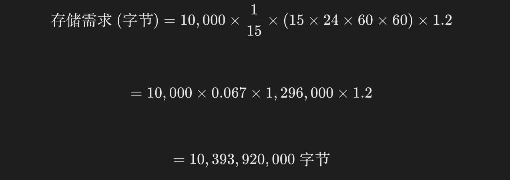

# Prometheus 容量规划

存储需求主要取决于以下几个因素：
1. 指标数量（Time Series Count）：你正在监控的总指标数量。
2. 样本速率（Sample Rate）：每个指标每秒生成的样本数。
3. 保留时间（Retention Time）：数据需要保留的时间长度。
4. 样本大小（Sample Size）：每个样本在磁盘上占用的空间，通常为 1.2 字节/样本（经过压缩）。

## 存储需求计算公式
``` 
存储需求(字节) = 指标数量 × 样本速率 × 保留时间(秒) × 样本大小(字节)
```
**详细说明**
- 指标数量：通常是 `Prometheus` 中活跃的时间序列数。
- 样本速率：一般情况下，每个指标每 `15` 秒收集一个样本（这是 `Prometheus` 的默认抓取间隔），因此样本速率为 `1/15` 秒，即 `0.067` 样本/秒。
- 保留时间：可以根据需要设置，一般为 `15` 天。
- 样本大小：经过 `Prometheus` 的压缩后，每个样本大约占用 `1.2` 字节。

**示例计算**

假设你有 `10,000` 个指标，每个指标每 `15` 秒抓取一个样本，数据保留 `15` 天。
1. 样本速率：每个指标每 `15` 秒抓取一次，即 `1/15` 样本/秒。
2. 保留时间：`15` 天 = `15 * 24 * 60 * 60` 秒。
3. 样本大小：每个样本占用 `1.2` 字节。

大约 10.4 GB


**公式解释**
- 指标数量：`10,000` 表示你有 `10,000` 个指标。
- 样本速率：`0.067` 表示每个指标每秒的采样率。
- 保留时间：`1,296,000` 秒是 `15` 天的总秒数。
- 样本大小：`1.2` 字节是每个样本的压缩大小。