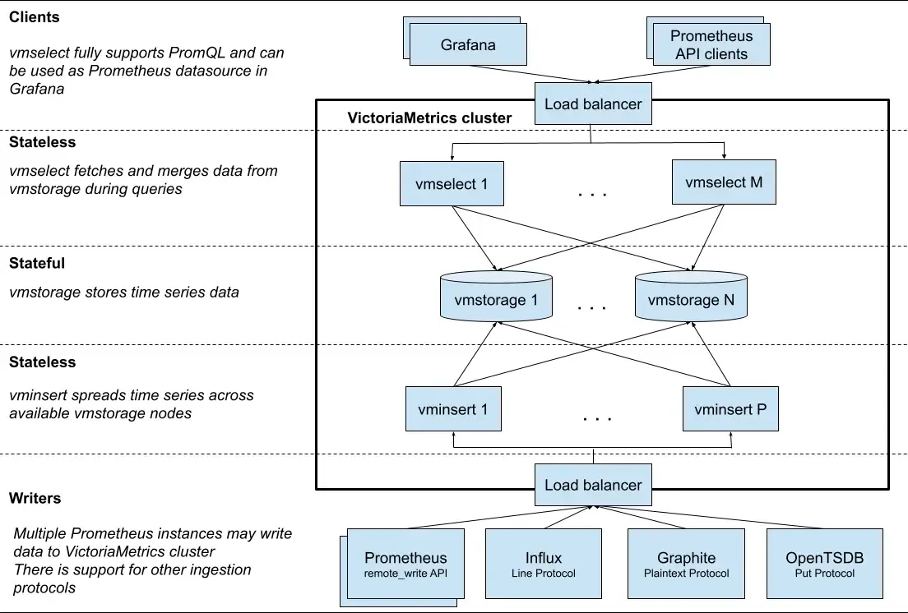
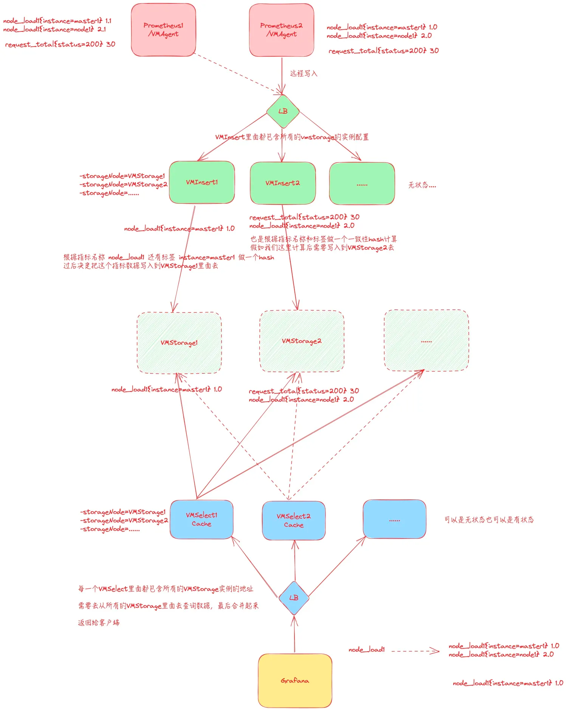
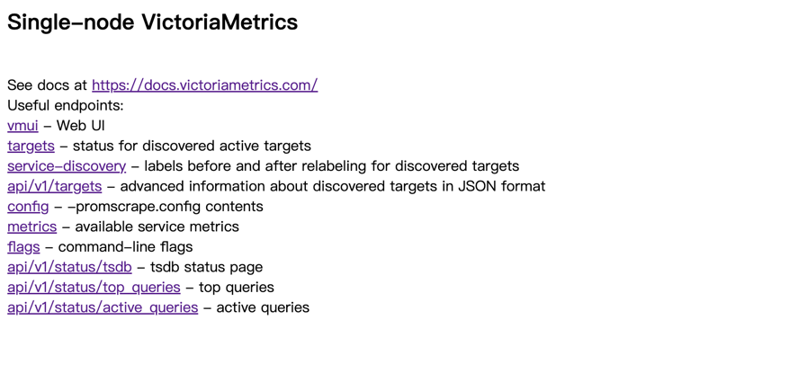

# VictoriaMetrics
## 简介
`VictoriaMetrics`是一种快速、经济高效且可扩展的监控解决方案和时间序列数据库。
支持单点和集群两种架构。官方给出**对于低于每秒一百万个数据点的摄取速率，建议使用单节点版本而不是集群版本**。但是建议在生产中使用多存储节点的模式，insert、select节点可以是单个，这样可以确保数据是高可用的。
建议至少有 50% 的可用内存，以便妥善处理可能的工作负载峰值。

简单举几个特点：

- 可以作为Prometheus的长期远端存储。

- Vmstore本身提供数据压缩，要比Prometheus本地存储、Thanos的所需存储空间低7倍。

- 在处理百万级别的时间序列（又名[高基数](https://docs.victoriametrics.com/faq/#what-is-high-cardinality)）时，比Prometheus、Thanos所需内存低7倍。

- 支持备份恢复。

## VMCluster
VMCluster是Victor Metrics的集群版，主要由三个组件组成；



### vmstorage（存储节点）
有状态服务

负责时序数据的长期存储。

处理数据的持久化，并且对数据进行压缩、归档以节省存储空间，同时保持高效的数据检索。在集群模式下，通常会有多个vmstorage节点支持更大规模的存储需求和提高数据冗余。
### vminsert（插入节点）
无状态服务

负责接收从客户端或代理发来的监控数据。

用来接收写请求、缓冲和批量处理数据，在处理好时序数据后再发送给存储节点，减少对存储节点的直接压力。
### vmselect（查询节点）
无状态服务

负责处理查询请求。

用来处理用户或程序请求数据时，vmselect从存储节点检索时序数据，并执行必要的过滤、聚合等工作。将最终结果返回给请求者。


## 生态
- [vmagent](https://docs.victoriametrics.com/vmagent/) - 轻量级代理，用于通过[基于拉动](https://docs.victoriametrics.com/vmagent/#how-to-collect-metrics-in-prometheus-format)和[基于推送](https://docs.victoriametrics.com/vmagent/#how-to-push-data-to-vmagent)的协议接收指标，将其转换并发送到已配置的与 Prometheus 兼容的远程存储系统，例如 VictoriaMetrics。

- [vmalert](https://docs.victoriametrics.com/vmalert/) - 用于处理与 Prometheus 兼容的警报和记录规则的服务。

- [vmalert-tool](https://docs.victoriametrics.com/vmalert-tool/) - 用于验证警报和记录规则的工具。

- [vmauth](https://docs.victoriametrics.com/vmauth/) - 针对 VictoriaMetrics 产品优化的授权代理和负载均衡器。

- [vmgateway](https://docs.victoriametrics.com/vmgateway/) - 具有每个租户速率限制功能的授权代理。

- [vmctl](https://docs.victoriametrics.com/vmctl/) - 用于在不同存储系统之间迁移和复制数据以获取指标的工具。

- [vmbackup](https://docs.victoriametrics.com/vmbackup/)、vmrestore和vmbackupmanager - 用于为 VictoriaMetrics 数据创建备份和从备份恢复的工具。

- [vmcluster](https://docs.victoriametrics.com/cluster-victoriametrics/) - vminsert、vmselect和VictoriaMetrics 集群vmstorage的组件。

- [VictoriaLogs](https://docs.victoriametrics.com/victorialogs/) - 用户友好、经济高效的日志数据库。


## VictoriaMetrics 单节点配置示例
单节点 VictoriaMetrics 的配置可以通过命令行参数或环境变量来设置。一些常用的配置选项包括：

- `httpListenAddr`: HTTP服务监听地址和端口（例如 "0.0.0.0:8428"）

- `retentionPeriod`: 数据保留期限，默认是1月（例如 "12" 表示12个月），最低保留24小时/1天

- `storageDataPath`：数据存储路径（例如 "/var/lib/victoriametrics/"）

- `promscrape.config`：prometheus target采集配置文件；

- `remoteWrite.url`：使用 Prometheus 兼容的远程存储端点（例如 VictoriaMetrics），将数据发送到哪里；

启动命令示例：
```
./victoria-metrics-prod \
-storageDataPath=/var/lib/victoriametrics/ \
-retentionPeriod=12 \
-httpListenAddr=0.0.0.0:8428
```
## VictoriaMetrics 集群配置示例
**vmstorage 配置**

- `httpListenAddr`: 该节点的HTTP监听地址和端口

- `vminsertAddr`: 处理vminsert流量的地址

- `vmselectAddr`: 处理vmselect流量的地址

- `storageDataPath`: 数据存储目录

- `retentionPeriod`: 数据保留期限

- `cluster.storageNodes`: 其他存储节点的地址列表

**vminsert 配置**

- `httpListenAddr`: vminsert节点HTTP监听地址和端口

- `storageNode`: vmstorage节点地址列表，vminsert会将数据分布到这些节点

**vmselect 配置**

- `httpListenAddr`: vmselect节点HTTP监听地址和端口

- `storageNode`: vmstorage节点地址列表，vmselect从这些节点查询数据


>对于生产环境，你可能还需要进行更多的调优，包括但不限于：
>- TLS/SSL 加密: 保护数据在传输过程中的安全。
>- 高可用性的配置： 包括数据的冗余存储、负载均衡和自动故障切换。 
>- 资源限制与调整： 根据系统资源（CPU、内存和存储IO）调整并发量、内存使用等。 
>- 监控和警报： 设置监控系统，对VictoriaMetrics的各项指标，如响应时间、错误率、资源使用状况进行实时监控，并在异常情况下发出警报。

---

## 快照功能

`vmbackup`工具为了安全性，避免将数据备份到`storageDataPath`指定的目录，因为这个目录由`VictoriaMetrics`实时使用。进行备份时，应选择另外的目录，以免备份操作与`VictoriaMetrics`存储实时数据的操作冲突，从而可能导致数据损坏或一系列的问题。

### 命令方式创建

支持备份到指定目录

- https://docs.victoriametrics.com/vmbackup/

``` 

vmbackup -storageDataPath /var/lib/victoriametrics/ -dst fs:///backups/victoriametrics/

```

### 接口方式创建

#### 创建快照

使用`/snapshot/create`以创建快照。

```
http://<victoriametrics-addr>:8428/snapshot/create

```

快照会在存储目录下创建<-storageDataPath>/snapshots，可以使用vmbackup随时将快照存档到备份存储。


页面返回以下 JSON 响应：

```
{"status":"ok","snapshot":"<snapshot-name>"}

```

#### 删除快照

**删除单个快照**

使用`/snapshot/delete`来删除快照。

```
http://<victoriametrics-addr>:8428/snapshot/delete?snapshot=<snapshot-name>
```

>注意：
> - 不要使用rm或类似命令删除其中的子目录，因为这将导致某些快照数据未被删除。更喜欢
> - 不要使用cp或rsync类似命令复制子目录，因为这些命令很可能不会复制快照中存储的某些数据。首选使用vmbackup来制作快照数据的副本。


**删除所有快照**


使用`/snapshot/delete_all`以删除所有快照。

``` 
http://<victoriametrics-addr>:8428/snapshot/delete_all

```
#### 查看快照
使用`/snapshot/list`返回可用快照的列表。
```
http://<victoriametrics-addr>:8428/snapshot/list
```
#### 快照恢复
恢复过程可以随时中断。当`vmrestore`使用相同的参数重新启动时，它会自动从中断点恢复。

``` 
./vmrestore -src=<storageType>://<path/to/backup> -storageDataPath=<local/path/to/restore>
```

- `<storageType>://<path/to/backup>`是使用`vmbackup`制作的备份路径`vmrestore`可以从以下存储类型恢复备份：
  - `gst`：-src=`gs://<bucket>/<path/to/backup>`
  - `S3`：-src=`s3://<bucket>/<path/to/backup>`
  - `Azure Blob 存储`：-src=`azblob://<container>/<path/to/backup>`
  - `任何与 S3 兼容的存储`，例如MinIO、Ceph 或Swift。参阅这些文档。
  - `本地文件系统`：-src=`fs://</absolute/path/to/backup>`
- `<local/path/to/restore>`是将恢复数据的文件夹的路径。

## 安装
### 单点模式部署
>单点架构是all-in-one，一个服务内集成多个功能，如：采集、写入、查询、存储等。


采集端配置
> 使用`Secret`可以实现配置热加载, 内容经过base64加密；
``` 
apiVersion: v1
kind: Secret
metadata:
  name: vm-agent-target
  namespace: observability
type: Opaque
data:
  prometheus.yaml: ICAgIGdsb2JhbDoKICAgICAgc2NyYXBlX2ludGVydmFsOiAxMHMKICAgIHNjcmFwZV9jb25maWdzOgogICAgICAtIGpvYl9uYW1lOiB2bWFnZW50CiAgICAgICAgc3RhdGljX2NvbmZpZ3M6CiAgICAgICAgICAtIHRhcmdldHM6IFsibG9jYWxob3N0Ojg0MjgiXQoKICAgICAgLSBqb2JfbmFtZTogImt1YmVybmV0ZXMtYXBpc2VydmVycyIKICAgICAgICBrdWJlcm5ldGVzX3NkX2NvbmZpZ3M6CiAgICAgICAgICAtIHJvbGU6IGVuZHBvaW50cwogICAgICAgIHNjaGVtZTogaHR0cHMKICAgICAgICB0bHNfY29uZmlnOgogICAgICAgICAgY2FfZmlsZTogL3Zhci9ydW4vc2VjcmV0cy9rdWJlcm5ldGVzLmlvL3NlcnZpY2VhY2NvdW50L2NhLmNydAogICAgICAgICAgaW5zZWN1cmVfc2tpcF92ZXJpZnk6IHRydWUKICAgICAgICBiZWFyZXJfdG9rZW5fZmlsZTogL3Zhci9ydW4vc2VjcmV0cy9rdWJlcm5ldGVzLmlvL3NlcnZpY2VhY2NvdW50L3Rva2VuCiAgICAgICAgcmVsYWJlbF9jb25maWdzOgogICAgICAgICAgLSBzb3VyY2VfbGFiZWxzOgogICAgICAgICAgICAgIFsKICAgICAgICAgICAgICAgIF9fbWV0YV9rdWJlcm5ldGVzX25hbWVzcGFjZSwKICAgICAgICAgICAgICAgIF9fbWV0YV9rdWJlcm5ldGVzX3NlcnZpY2VfbmFtZSwKICAgICAgICAgICAgICAgIF9fbWV0YV9rdWJlcm5ldGVzX2VuZHBvaW50X3BvcnRfbmFtZSwKICAgICAgICAgICAgICBdCiAgICAgICAgICAgIGFjdGlvbjoga2VlcAogICAgICAgICAgICByZWdleDogZGVmYXVsdDtrdWJlcm5ldGVzO2h0dHBzCiAgICAgIC0gam9iX25hbWU6ICJrdWJlcm5ldGVzLW5vZGVzIgogICAgICAgIHNjaGVtZTogaHR0cHMKICAgICAgICB0bHNfY29uZmlnOgogICAgICAgICAgY2FfZmlsZTogL3Zhci9ydW4vc2VjcmV0cy9rdWJlcm5ldGVzLmlvL3NlcnZpY2VhY2NvdW50L2NhLmNydAoKICAgICAgICAgIGluc2VjdXJlX3NraXBfdmVyaWZ5OiB0cnVlCiAgICAgICAgYmVhcmVyX3Rva2VuX2ZpbGU6IC92YXIvcnVuL3NlY3JldHMva3ViZXJuZXRlcy5pby9zZXJ2aWNlYWNjb3VudC90b2tlbgogICAgICAgIGt1YmVybmV0ZXNfc2RfY29uZmlnczoKICAgICAgICAgIC0gcm9sZTogbm9kZQogICAgICAgIHJlbGFiZWxfY29uZmlnczoKICAgICAgICAgIC0gYWN0aW9uOiBsYWJlbG1hcAogICAgICAgICAgICByZWdleDogX19tZXRhX2t1YmVybmV0ZXNfbm9kZV9sYWJlbF8oLispCiAgICAgICAgICAtIHRhcmdldF9sYWJlbDogX19hZGRyZXNzX18KICAgICAgICAgICAgcmVwbGFjZW1lbnQ6IGt1YmVybmV0ZXMuZGVmYXVsdC5zdmM6NDQzCiAgICAgICAgICAtIHNvdXJjZV9sYWJlbHM6IFtfX21ldGFfa3ViZXJuZXRlc19ub2RlX25hbWVdCiAgICAgICAgICAgIHJlZ2V4OiAoLispCiAgICAgICAgICAgIHRhcmdldF9sYWJlbDogX19tZXRyaWNzX3BhdGhfXwogICAgICAgICAgICByZXBsYWNlbWVudDogL2FwaS92MS9ub2Rlcy8kMS9wcm94eS9tZXRyaWNzCg==
```

Deploy
``` 
apiVersion: v1 
kind: PersistentVolumeClaim 
metadata: 
  name: victoria-metrics-data
  namespace: observability
spec: 
  storageClassName: "local-path" 
  accessModes: 
    - ReadWriteOnce
  resources: 
    requests: 
      storage: 100Gi 
---
apiVersion: apps/v1
kind: Deployment
metadata:
  name: victoria-metrics
  namespace: observability
spec:
  selector:
    matchLabels:
      app: victoria-metrics
  template:
    metadata:
      labels:
        app: victoria-metrics
    spec:
      containers:
        - name: vm
          image: victoriametrics/victoria-metrics:v1.79.8
          imagePullPolicy: IfNotPresent
          args:
            - -storageDataPath=/var/lib/victoria-metrics-data
            - -retentionPeriod=2w
            - -promscrape.config=/etc/prometheus/prometheus.yaml
          ports:
            - containerPort: 8428
              name: http
          volumeMounts:
            - mountPath: /var/lib/victoria-metrics-data
              name: storage
            - mountPath: "/etc/prometheus/"
              name: prometheus-config
              readOnly: true
      volumes:
        - name: prometheus-config
          secret:
            secretName: vm-agent-target
            items:
            - key: "prometheus.yaml"
              path: "prometheus.yaml"
        - name: storage
          persistentVolumeClaim:
            claimName: victoria-metrics-data
---
apiVersion: v1
kind: Service
metadata:
  name: victoria-metrics
  namespace: observability
spec:
  type: NodePort
  ports:
    - port: 8428
  selector:
    app: victoria-metrics
```
**配置热加载**

当修改采集配置后可通过发送`Post`请求来热加载配置文件
```
curl -X POST http://192.168.1.190:31425/-/reload
```

**UI**

VM的UI也提供了像`Prometheus`那种很丰富的查询功能；



---
### 集群模式部署
VM集群服务间请求方式
- 查询：http://vmselect-vmcluster:8481/select/0/prometheus/
- 写入：http://vminsert-vmcluster:8480/insert/0/prometheus/api/v1/write
#### Operator
**安装Operator**
``` 
# helm repo add vm https://victoriametrics.github.io/helm-charts
# helm repo update
# helm install victoria-operator vm/victoria-metrics-operator
```
``` 
# kubectl -n monitoring get pod
NAME                                                           READY   STATUS    RESTARTS   AGE
victoria-operator-victoria-metrics-operator-7b886f85bb-jf6ng   1/1     Running   0          20s

```
**安装核心组件**
- https://docs.victoriametrics.com/operator/resources/vmcluster/

集群配置
``` 
# vi vmcluster.yaml
apiVersion: operator.victoriametrics.com/v1beta1
kind: VMCluster
metadata:
  name: vmcluster
  namespace: monitoring
spec:
  retentionPeriod: "1" 
  vmstorage:
    replicaCount: 2
    image:
      repository: victoriametrics/vmstorage
      tag: v1.93.4-cluster
      pullPolicy: Always
    storage:
      volumeClaimTemplate:
        metadata:
          name: data
        spec:
          accessModes: [ "ReadWriteOnce" ]
          storageClassName: cbs
          resources:
            requests:
              storage: 100Gi
    resources:
      limits:
        cpu: "1"
        memory: "1Gi"
      requests:
        cpu: "0.5"
        memory: "500Mi"
              
  vmselect:
    replicaCount: 2
    cacheMountPath: "/select-cache"
    image:
      repository: victoriametrics/vmselect
      tag: v1.93.4-cluster
      pullPolicy: Always
    storage:
      volumeClaimTemplate:
        spec:
          resources:
            requests:
              storage: "1Gi"
    resources:
      limits:
        cpu: "1"
        memory: "1Gi"
      requests:
        cpu: "0.5"
        memory: "500Mi"
        
  vminsert:
    replicaCount: 2
    image:
      repository: victoriametrics/vminsert
      tag: v1.93.4-cluster
      pullPolicy: Always
    resources:
      limits:
        cpu: "1"
        memory: "1Gi"
      requests:
        cpu: "0.5"
        memory: "500Mi"
```
安装
``` 
# kubectl apply -f vmcluster.yaml
vmcluster.operator.victoriametrics.com/vmcluster created
```
查看状态
``` 

# kubectl -n monitoring get pod | grep vmcluster
vminsert-vmcluster-77886b8dcb-jqpfw                            1/1     Running   0          20s
vminsert-vmcluster-77886b8dcb-l5wrg                            1/1     Running   0          20s
vmselect-vmcluster-0                                           1/1     Running   0          20s
vmselect-vmcluster-1                                           1/1     Running   0          20s
vmstorage-vmcluster-0                                          1/1     Running   0          20s
vmstorage-vmcluster-1                                          1/1     Running   0          20s
```
**安装VM Agent**
采集配置
``` 
apiVersion: v1
kind: Secret
type: Opaque
metadata:
  name: prom-scrape-configs
  namespace: monitoring
stringData:
  prom-scrape-configs.yaml: |-

    - job_name: 'kubernetes-kubelets'
      kubernetes_sd_configs:
        - role: node
      relabel_configs:
        - source_labels: [__address__]
          regex: '(.*):10250'
          replacement: '${1}:9100'
          target_label: __address__
          action: replace
        - action: labelmap
          regex: __meta_kubernetes_node_label_(.+)
```

服务部署配置
``` 
apiVersion: operator.victoriametrics.com/v1beta1
kind: VMAgent
metadata:
  name: vmagent
  namespace: monitoring
spec:
  selectAllByDefault: true
  additionalScrapeConfigs:
    key: prom-scrape-configs.yaml
    name: prom-scrape-configs
  resources:
    requests:
      cpu: 10m
      memory: 10Mi
  replicaCount: 1
  remoteWrite:
  - url: "http://vminsert-vmcluster:8480/insert/0/prometheus/api/v1/write"
```
> 注意：如果以高可用方式（多副本）运行，必须开启重复数据删除的功能。
>- 移步至：https://docs.victoriametrics.com/operator/resources/vmagent/#high-availability

安装
``` 
# kubectl apply -f scrape-config.yaml
secret/prom-scrape-configs created
# kubectl apply -f vmagent.yaml
vmagent.operator.victoriametrics.com/vmagent created
# kubectl -n monitoring get pod | grep vmagent
vmagent-vmagent-cf9bbdbb4-tm4w9                                2/2     Running   0          20s
```
参考文档
- https://docs.victoriametrics.com/
- https://www.qikqiak.com/post/victoriametrics-usage/#%E6%9B%BF%E6%8D%A2-prometheus

## VMStorage 存储规划

### 计算公式
磁盘用量(bytes) = 瞬时指标量[m] x 单个数据点大小 x 60 x 24 x 存储时间（天)

瞬时存储的指标量：`max(increase(vm_rows{}[1m]))`

单个数据点大小：`sum(vm_data_size_bytes{}) / sum(vm_rows{})`
