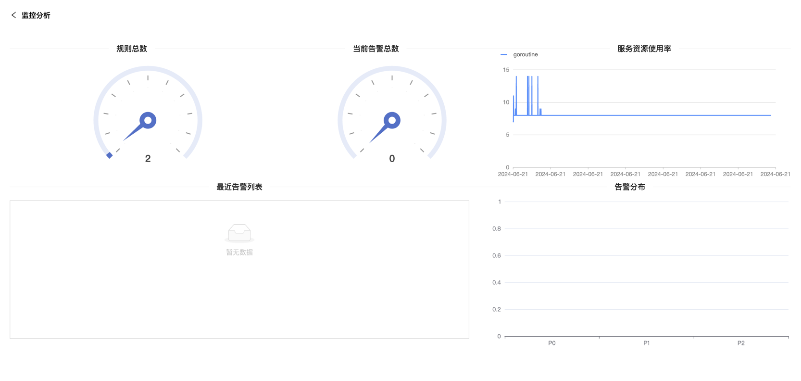

# 监控分析

> 本章介绍一下 WatchAlert 的首页，也就是监控分析。它是用来展示当前监控系统中所涉及比较关注的数据，能够让相关负责人/维护人一眼看到比较重要的数据。

如图所示

## 分为五大类

- 规则总数：用来明确当前监控系统中，有多少已添加的告警规则；

- 当前告警总数：当前正在触发的告警有多少条；

- 服务器资源使用率：观察`WatchAlert`本身使用了多少协程，能够反映出该服务占用多少资源。

- 最近告警列表：展示当前正在告警的Top10条目；

- 告警分布：明确当前有多少条P0、P1、P2级别的告警；
