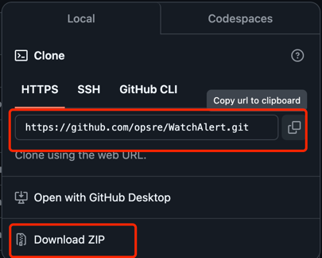
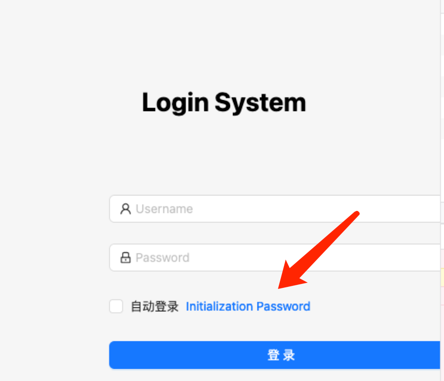

# 安装流程

::: tip 提示
在安装之前请确保您已经正确安装并启动`Docker`服务 和`docker-compose`指令；
:::

## 安装步骤如下

### 克隆项目
- 有网络条件的可以直接`Clone`。
- 没有网络条件可以下载`ZIP`包，导入到服务器上。


### 进入项目目录
``` 
# cd WatchAlert-master/deploy/docker-compose
```

### 启动项目
```shell
# docker-compose -f docker-compose.yaml up -d
# docker-compose -f docker-compose.yaml ps
   Name                  Command               State                 Ports              
----------------------------------------------------------------------------------------
w8t-mysql     docker-entrypoint.sh mysqld      Up      0.0.0.0:3306->3306/tcp, 33060/tcp
w8t-redis     docker-entrypoint.sh redis ...   Up      6379/tcp                         
w8t-service   /app/watchAlert                  Up      0.0.0.0:9002->9001/tcp           
w8t-web       /bin/sh -c REACT_APP_BACKE ...   Up      0.0.0.0:80->3000/tcp      
```

⚠️ 注意：
- docker-compose.yaml 中有init容器，当我们初次启动成功后，可以移除init重启，避免重复导入数据。

### 访问项目
- 登陆页初始化`admin`密码.

