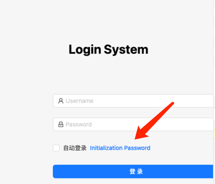

# 安装流程

::: tip 提示
在安装之前请确保您已经存在`Kubernetes`集群；
:::

## 安装步骤如下
### 克隆项目
- 有网络条件的可以直接`Clone`。
- 没有网络条件可以下载`ZIP`包，导入到服务器上。
  

### 进入项目目录
``` 
# cd WatchAlert-master/deploy/kubernetes
```

### 创建配置
``` 
# kubectl create configmap w8t-config --from-file=../../config/config.yaml
```
``` 
# kubectl create configmap w8t-init-config --from-file=../sql/auto_import.sh --from-file=../sql/notice_template_examples.sql --from-file=../sql/rule_template_groups.sql \
--from-file=../sql/rule_templates.sql --from-file=../sql/tenants.sql --from-file=../sql/tenants_linked_users.sql
```

``` 
# kubectl apply -f mysql.yaml -f redis.yaml -f w8t-service.yaml -f w8t-web.yaml -f init-job.yaml
```

⚠️ 注意：
- init job 运行结束后请勿再次运行，以防数据重复。

### 访问项目
- http://${HOST}:30800（svc nodePort）
- 登陆页初始化`admin`密码.

